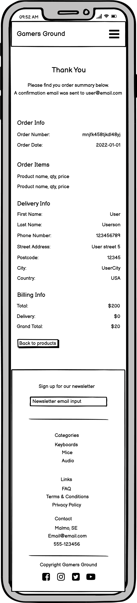
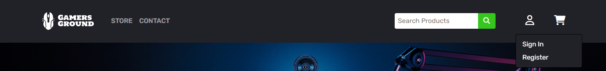
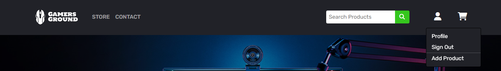
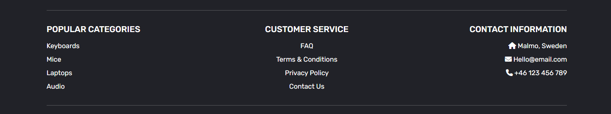
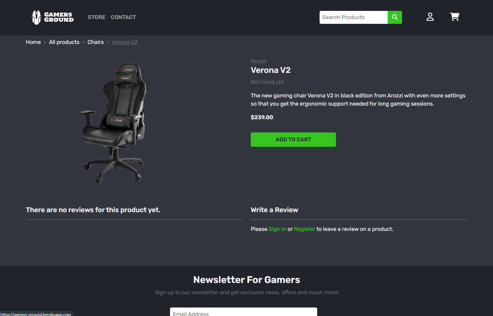
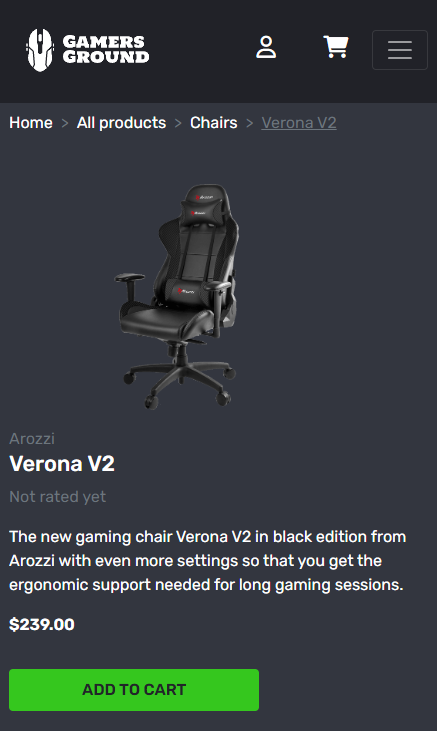
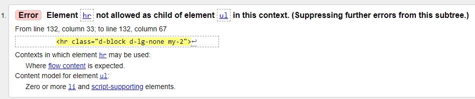
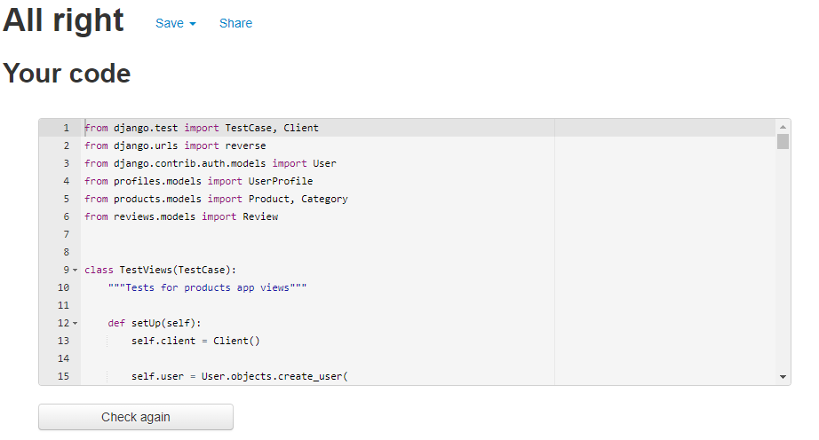
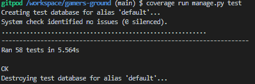

# Gamers Ground

Gamers Ground is a B2C e-commerce website for people interested in pc gaming. If you're a hardcore gamer that needs the best gear on the market, we got you covered! Looking for a more affordable option? We have what you need! We will continue to add new products as our stock will grow, so check in regularly to find your favourite gear.

*This project is a fictional e-commerce store that does not generate any revenue or take real orders. To place a mock order, please use the following card number: 4242 4242 4242 4242, with any expiration date in the future. To learn more about how to test the payment system, please visit [Stripe](https://stripe.com/docs/testing)*

[Find the live website here!](https://gamers-ground.herokuapp.com/)


# Table of Contents

- [Gamers Ground](#gamers-ground)
- [Table of Contents](#table-of-contents)
- [User Experience (UX)](#user-experience-ux)
  * [Strategy](#strategy)
  * [Scope](#scope)
  * [Structure](#structure)
  * [Skeleton](#skeleton)
  * [Surface](#surface)
- [Data Model](#data-model)
  * [Codebase](#codebase)
  * [Models](#models)
  * [Model Addition](#model-addition)
- [Agile Methodology](#agile-methodology)
- [Search Engine Optimization](#search-engine-optimization)
  * [Keywords](#keywords)
  * [Content](#content)
  * [Images and Links](#images-and-links)
  * [Meta Data](#meta-data)
  * [Sitemap.xml File](#sitemapxml-file)
  * [Robots.txt File](#robotstxt-file)
- [Business Model](#business-model)
- [Marketing](#marketing)
    + [Search Engine Optimization](#search-engine-optimization-1)
    + [Social Media Marketing](#social-media-marketing)
    + [Email Marketing](#email-marketing)
- [Features](#features)
  * [Header](#header)
  * [Home Page](#home-page)
  * [Footer](#footer)
  * [Products Page](#products-page)
  * [Product Detail](#product-detail)
  * [Cart Page](#cart-page)
  * [Checkout Page](#checkout-page)
  * [Checkout Success Page](#checkout-success-page)
  * [Authentication System](#authentication-system)
  * [Profile Page](#profile-page)
  * [Product Management (Site Admin)](#product-management-site-admin)
  * [Toast Messages](#toast-messages)
  * [Customer Service Pages](#customer-service-pages)
  * [Contact Page](#contact-page)
  * [Features Left to Implement](#features-left-to-implement)
- [Testing](#testing)
  * [Code Validation](#code-validation)
  * [Responsive Testing](#responsive-testing)
  * [Lighthouse Testing](#lighthouse-testing)
  * [Manual Testing](#manual-testing)
  * [User Story Testing](#user-story-testing)
  * [Automated Testing](#automated-testing)
  * [Fixed Bugs](#fixed-bugs)
  * [Known/Unfixed Bugs](#knownunfixed-bugs)
- [Technologies Used](#technologies-used)
  * [Languages](#languages)
  * [Python Packages](#python-packages)
  * [Programs & Libraries](#programs--libraries)
- [Deployment](#deployment)
  * [1. Create a repository in GitHub and clone to a local machine](#1-create-a-repository-in-github-and-clone-to-a-local-machine)
  * [2. Set up a virtual environment](#2-set-up-a-virtual-environment)
  * [3. Install packages and libraries](#3-install-packages-and-libraries)
  * [4. Create Django project](#4-create-django-project)
  * [5. Create an app on Heroku](#5-create-an-app-on-heroku)
  * [6. Set up environment variables](#6-set-up-environment-variables)
  * [7. Update settings.py file](#7-update-settingspy-file)
  * [8. Deploy to Heroku](#8-deploy-to-heroku)
  * [9. Set up AWS to serve static files, S3 Bucket setup](#9-set-up-aws-to-serve-static-files-s3-bucket-setup)
  * [10. Set up AWS IAM User setup](#10-set-up-aws-iam-user-setup)
  * [11. Connect AWS S3 to your project](#11-connect-aws-s3-to-your-project)
  * [12. Set up Stripe Integrated Payments](#12-set-up-stripe-integrated-payments)
- [Credits](#credits)
  * [Code](#code)
  * [Content](#content-1)
  * [Media](#media)
  * [Acknowledgements](#acknowledgements)

# User Experience (UX)

The five planes of UX Design were implemented during the planning stage of the project. A summary of each stage is presented below.

## Strategy

### Target audience:

- Younger men and women interested in tech

- People with an interest in PCs and gaming

- Friends and family looking for gifts to purchase

### User goals:

- Be able to browse through products in an intuitive and easy way

- Find valuable and understandable info about products

- Add multiple products to cart so I can buy more than one product at a time

- Purchase a product with minimal friction and receive confirmation

- Become a member and save my information for future purchases

- See previous orders as a member

- Leave ratings / reviews on products I have purchased

- View other customers ratings / reviews to help make an informed decision on purchasing a product

### Site admin goals:

- Have an easily manageable and trustworthy site

- Be able to add, edit and delete products from the stock

- Be able to edit / delete objectionable reviews left by site users

- If a user breaks site policy and behaves in an ill-mannered way, be able to remove their account

- Have an emailing list set up to promote my site with news and sales etc.

### User Stories

The user stories were implemented in an agile approach when creating the application, developed in order of importance. They were broken up into the following Epics to help with project management.

- #### EPIC: User Authentication / Accounts

  - As a Site User I can register an account so that I can sign in / out when revisiting the site.

  - As a Signed In User I can view and update my information so that I can make sure the correct info is stored on me.

  - As a Signed In User I can delete my account so that no information is stored on me.

  - As a Signed In User I can view previous order information so that I can see the details and make sure the orders are correct.

  - As a Signed In User I can save my info or have my information prefilled at checkout if it's already saved so that my saved info is used, and I don't have to fill it out.

  - As a Signed In User I can reset my password using my email so that I can gain access to my account if I forget my password.

- #### EPIC: User Site Navigation

  - As a Site User I can easily find and view products available so that I can browse products I may want to buy.

  - As a Site User I can click a product and view all info so that I can learn more about the product and see if I want to purchase it.

  - As a Site User I can search for products using keywords so that I can find a specific product I have in mind.

  - As a Site User I can add a filter to the products so that I can find specific products I am looking for.

  - As a Site User I can sort products by name, price, category etc. so that I can find certain / similar products easier.

  - As a Site User I can click on the cart so that I can view the products I have saved for purchase and my total cost.

  - As a Site User I can read other users reviews on products so that I can gain understanding of a products customer satisfaction.

- #### EPIC: User Site Interaction

  - As a Site User I can add products to a cart so that I can save it and purchase more than one product at a time.

  - As a Site User I can see the number of items OR the total cost by the cart icon in the upper right corner when editing my cart so that I know how many items I have added / how much my total is.

  - As a Site User I can edit my saved items on the cart page so that I can change my cart content as I wish.

  - As a Site User I can delete saved items on the cart page so that I can change my cart content as I wish.

  - As a Site User I can expect confirmation on my interactions with the site so that my actions get confirmed.

  - As a Site User I can rate / review products I have purchased so that I can share my product experience with other customers.

  - As a site user I can delete my own review so that I can decide which of my own content is visible, and I can write a new review if I wish.

  - As a Site User I can contact Gamers Ground so that I can ask questions or give feedback. *

- #### EPIC: User Checkout

  - As a Site User I can view details of my order on the checkout page so that I can make sure everything is correct before placing my order.

  - As a Site User I can checkout and pay for the products in my cart so that I can buy and receive my newly purchased products.

  - As a Site User I can have my order confirmed after a purchase so that I can be certain my payment was processed successfully.

- #### EPIC: Site Admin

  - As a Site admin I can add products to the site so that I can control the selection of products being sold.

  - As a Site admin I can edit products on the site so that I can make sure the products being sold are correctly represented.

  - As a Site admin I can delete products on the site so that I can control the selection of products being sold.

  - As a Site Admin I can manage reviews posted by customers so that I can make sure no objectionable content is present.

  - As a Site Admin I can manage and respond to inquiries so that I can communicate with customers. *

\* Added late in the project since time permitted it, and a simple contact system was implemented.

## Scope

The scope of the project was determined by prioritizing to get a Minimum Viable Product deployed, and if time permits, add on additional features. A basic MoSCoW method was implemented on user stories where each user story received a label defining it as either 'Must Have', 'Should Have' or 'Could Have'. They were broken up into epics to gain better project overview and help plan the development process. Both tasks and acceptance criteria were given to each user story to assure that the intended feature was implemented correctly. For further details of tasks and acceptance criteria, and a list of all user stories, see this project's [GitHub Issues Tab](https://github.com/LucasBehrendt/gamers-ground/issues) In general, the higher priority user stories were implemented earlier.

### Core features

-	An inviting landing page that incentivizes the user to explore the site further

-	Products listings where users can search, filter and sort products in a relevant way

-	Products are visually inviting and professionally presented

-	Cart functionality to save multiple items for purchasing before proceeding to checkout

-	Checkout system that gives users a professional and trustworthy feel with confirmation email sent after a placed order

-	Authentication system for site users, where they can save their info and view previous orders

-	User feedback on all interactions with the site, such as adding to cart, signing up, updating cart etc

-	Site admins have full CRUD functionality over products and can control the selection of products entirely (Through site UI)

-	Ratings / review system for customers who wants to give feedback on purchased products

-	Site admins have full CRUD functionality over written reviews and can remove objectionable ones (Through Django Admin panel)

## Structure

The website is structured with simplicity and accessibility in mind, where both shoppers and site admins can intuitively navigate the site. Consistency in structure and layout is evident, to allow site users to gain a recognizable feel of the Gamers Ground brand. Combined with predictable behaviour and layout through all site pages, navigation through the site is a pleasing and positive experience.

### Information Architecture

To facilitate an intuitive and easily navigated site, Information Architecture was considered when structuring the pages throughout the website. Features that help users understand where they are, and where certain information can be found were implemented. Examples of these features include user-friendly urls, that show both the category and the product name when viewing a specific product, a breadcrumb navigation on product list and detail pages for ease of access to other related products, and clear confirmations on all user interactions.

To help facilitate a logical flow of the application during the development process, a simple flowchart / site map was created using [LucidChart](https://www.lucidchart.com/pages/).

<details>

<summary>Flowchart / Site Map</summary>


</details>

After adding the contact page, the flowchart was updated to include it. The addition can be seen below.

<details>

<summary>Updated Flowchart</summary>


</details>

## Skeleton

The structure and layout defined above was expressed with the help of wireframes in the planning process. These mock-ups are intended to show the overall layout of all pages within the website. While the wireframes are similar to the finished project, some changes were made during development to better suit content, information architecture, and overall structure.

The authentications system / templates with sign in, sign out, registration, email verification etc. was provided by Allauth. The templates used have only been slightly styled to fit the rest of the site, and therefore no wireframes were made of those pages.

### Wireframes

[Balsamiq](https://balsamiq.com/) was utilized when creating the wireframes below.

<details>

<summary>Desktop wireframes</summary>

Home Page<br>


Products Page<br>


Product Detail Page<br>


Cart Page<br>


Checkout Page<br>


Checkout Success Page<br>


Profile Page<br>


Add Product Page (site admins)<br>


</details>

<details>

<summary>Mobile wireframes</summary>

Home Page<br>


Products Page<br>


Product Detail Page<br>


Cart Page<br>


Checkout Page<br>


Checkout Success Page<br>


Profile Page<br>


Add Product Page (site admins)<br>


</details>

Wireframes for the contact page implemented in the late stages of the development process were created just before building the web page itself. For that reason, they are presented separately below.

<details>

<summary>Contact Page wireframes</summary>

Contact Page Desktop<br>


Contact Page Mobile<br>


</details>

## Surface

The website's surface is designed to be inviting and polished to invoke a positive response from users when they land on the home page. Several call-to-action buttons help incentivize the user to explore the site further. A balanced feel of simplicity and gaming themed design was prioritized, and low friction was always kept in mind during the designing phase.

### Design
- #### Colours

  The colours used on the site are meant to convey a theme of pc gaming with dark / mid grey, complemented with a popping lime / neon green colour for buttons and links. The main background colour is a mid-grey colour (#33363f) that goes nicely with the theme and the palette chosen. Sections, cards, and header / footer breaks off the background with a darker grey (#212228) that complements each other nicely. The green colour chosen for the buttons and links (#35C71E) help make the website feel more vibrant and catches the user's attention straight upon landing on the home page. It also goes very nicely with the grey colours and give good contrast to text / elements. To help product cards and other module sized content stand out and feel more inviting, a solid black (#000) border was added in the later stages of development.

  Where necessary, a red 'danger' colour was implemented to alert users of an action where they would delete data, like a review or their account. The same goes for the site admin links / buttons where appropriate.

  <details>

  <summary>Colour Palette</summary>

  

  </details>

- #### Imagery

  The images are an important part of mainly the landing page, where large gripping images are meant to convey a sense of gaming enthusiasm and excitement for shoppers. A bootstrap carousel at the very top of the home page shows three eye-catching images of gaming peripherals, and content hinting with a gaming desktop lies just underneath. A nicely laid out grid of categories with accompanying images is found further down, where users easily can find a quick route to their favourite category. Across the other pages, the product images are the main focus, to help keep a clean and minimalistic design.

- #### Typography

  The font chosen for the site is Rubik, a nicely edgy and well-fitting font for gaming and tech content. Both different font sizes and weights have been user throughout the site, and consistency was always kept in mind. If the font isn't imported correctly, Sans-serif will serve as fallback.

# Data Model

## Codebase

The codebase includes the following apps and folders:

- Cart app, for managing adding products to a cart.

- Checkout app, handles the payment system and orders.

- Home app, renders home page, contact page, and customer service pages.

- Products app, handles creating, storing, and rendering products.

- Profiles app, holds the profile model which extends user model.

- Review app, lets users leave a rating and review on products.

- Media  folder, holds product images.

- Static folder, holds static files and images.

- Templates folder, holds base, error, allauth, and toasts templates.

## Models

The database used for the application requires several models which will be defined below. The user authentication system is included in Django Allauth and a User model was therefore already provided. However, this model was extended with a Profile model which you'll also find below.

To get an idea of the relationships and fields required in the models, an ERD (Entity Relationship Diagram) was created using [LucidChart](https://www.lucidchart.com/pages/).

<details>

<summary>Entity Relationship Diagram</summary>


</details>

### User Model

- Provided by Django Allauth, users receive a unique ID which will serve as FK (Foreign Key) to other models in the database.

- Upon registration, users choose a username, email, and password.

- To improve user experience, registration was extended to also include users first and last name. These will then be visible on their profile, as well as pre-filled at checkout.

### UserProfile Model

- Extends User model with delivery information to allow users to save it for future purchases.

- Includes an OneToOneField to User model, which allows the UserProfile model to be created automatically when a new user registered with the help of a post_save signal.

- The remaining fields are delivery information fields, namely phone_number, street_address_1, street_address_2, postcode, city, and country.

### Category Model

- Implemented with SEO-friendly urls in mind, this model has a name field and a slug field.

- The slug field is automatically generated when a category is created, and later used in the url when visiting a product / category page.

### Product Model

- Products are assigned a category through an FK to the Category model.

- This model also includes an automatically generated slug field from the name field of the product. Again, this makes the url easier to follow.

- A brand and a description field let shoppers know more about the product and gives them the chance to find products of their favourite brand.

- The product has an image field and price field, as well as a field for rating.

- The rating is updated when a review is posted on the product through a method that calculates the average rating.

### Order Model

- The Order model features a randomly generated order number, and an FK to UserProfile to assign orders to authenticated users.

- Personal info fields include first_name, last_name, email_address and phone_number. These are prefilled with authenticated users' info at checkout.

- Delivery info fields include street_address_1, street_address_2, postcode, city, and country. Just like the personal info, these will be prefilled with available UserProfile data.

- The fields delivery_cost, order_total, and grand_total are set automatically through a method that calculates the total as products are added to the order, and for orders above a certain sum, the shipping fee is removed.

- Lastly a field to hold the Stripe payment intent ID, stripe_pid, makes sure no orders are confused with each other.

### OrderLineItem Model

- Serves as a temporary state for products added to an order, where the FK to the Order model assigns it to a specific order.

- The product field, an FK to the Product model, makes sure the correct product is represented.

- To allow shoppers to purchase more than one of a given product, a quantity field holds the number of line items to be purchased.

- To easily calculate the total cost of an item, the lineitem_total field automatically multiplies product price with the quantity defined above.

### Review Model

- Reviews are assigned a user through an FK to the User model.

- The Product model serves as FK on the product field.

- Choices from 1 to 5 are defined for the rating field to let users give products a rating.

- A review text field allow users to write some thoughts on a product along with their rating.

- The created_on field tells users when a specific review was posted.

## Model Addition

An Inquiry model was added late in the development process, as time permitted a simple contact system. The model was added to the ERD (Entity Relationship Diagram), which can be seen below.

<details>

<summary>Updated ERD</summary>


</details>

### Inquiry Model

- Users are required to fill out their first and last name, along with their email address.

- A phone number can be submitted, although it is optional.

- The inquiry text field lets users ask questions, and the created_on field is automatically set.

- Users do not need to be authenticated, but if they are, their info will be prefilled.

# Agile Methodology

To better plan and understand the development process, an agile approach was taken when implementing features. GitHub Projects provides a great way of keeping track of progress made and user stories to develop. By creating a project board on a basic Kanban template, the development process can be overviewed and tackled in a proficient and time-effective way. Epics were defined (as GitHub Milestones) to get a sense of the overall aim of the project. Each user story created was then assigned to an Epic and added to the project board. The board features three columns for every step of the development process, To-do, In Progress and Done. As user stories were added to the board, their status was automatically set to To-do. They were then moved to In Progress as the feature was being developed, and finally to Done when it was implemented on the application.

For each user story created, a set of acceptance criteria were defined to help clarify what a specific feature is expected to fulfil for users. Coupled with the acceptance criteria, tasks were assigned as a way of keeping track on what steps would need to be taken in order to implement any given feature. This helped keep an organized and agile mindset on how to get the best result within a reasonable timeframe.

Labels were created and assigned to each user story to help keep track of the importance. The MoSCoW method is a practical way of assigning priority to user stories and helps planning the development of the application. The labels define user stories as either 'Must Have', 'Should Have' or 'Could Have'. While all user stories were completed, this method provided a valuable way of ensuring that the most important features were implemented first.

This agile approach is especially powerful when working in teams, but still made the development process more enjoyable and easier to keep track of when developing alone. To view the project board and all user stories, see [Gamers Ground Project Board](https://github.com/users/LucasBehrendt/projects/2)

<details>

<summary>GitHub Project Board</summary>


</details>

# Search Engine Optimization

To help users find the website easier, Search Engine Optimization techniques were employed as part of the development process. Some of these techniques are outlined below.

## Keywords

By researching and implementing the use of keywords that search engines deem authoritative and relevant to the site, better ranking can be achieved. The process of implementing these started with doing research of general topics applicable to the content of the application.

These topics are as follows:

- **Gaming Peripherals**

- **Desktops / Laptops**

- **Brands**

To find as many keywords as possible, a brainstorming session was undertaken with the following result:

**Gaming Peripherals**

- Gaming keyboard

- Gaming mouse

- Best gaming gear

- Gaming accessories

- Best keyboard / mouse for gaming

- Gaming peripherals

- Ergonomic gaming chair

- Mechanical gaming keyboard

- Mechanical wireless keyboard

- Buy affordable gaming peripherals

- Affordable gaming peripherals

- TKL keyboard

**Desktops / Laptops**

- Best desktops for gaming

- Best laptops for gaming

- Gaming pc

- Gaming laptop

- Buy affordable gaming desktop

- Buy affordable gaming laptop

- Gaming pc with rgb

- Affordable laptops for gaming

- Buy desktop for gaming

- Laptop with rgb

- Ultimate gaming rig

- Powerful gaming laptop

- Best gaming pc

- Affordable gaming pc

- Gaming rig

- Computer for gaming

- Budget gaming pc

**Brands**

- Gaming pc brands

- Best brands for pc gaming

- Best gaming gear brand

- SteelSeries peripherals

- Razer mouse / keyboard

- Logitech gaming bundle

- Logitech mechanical keyboard

- Razer gaming peripherals

- Razer blade laptop

After careful consideration, and extensive research through both manual google searches and the site [WordTracker](https://www.wordtracker.com/), the list was narrowed down and divided in to short-tail and long-tail keywords. Many of the written down keywords were either too popular and competition-heavy, or not authoritative and relevant to the content of the site. These have not been used consciously for SEO reasons but might still be present on the site in generic text / content.

The chosen keywords:

**Short tail keywords**

- Gaming peripherals

- TKL keyboard

- Gaming pc

- Gaming laptop

- SteelSeries peripherals

- RGB lighting

**Long tail keywords**

- Ergonomic gaming chair

- Mechanical gaming keyboard

- Gaming pc with RGB

- Ultimate gaming rig

- Powerful gaming laptop

- Logitech mechanical keyboard

- Razer gaming peripherals

- Razer blade laptop

These keywords were then used as part of the content in an organic way and should never disturb the flow of the site. Some keywords are present on the landing page, where semantically relevant HTML, such as h1, h2 and strong tags were used to help boost the keywords visibility while avoiding keyword stuffing. Other keywords are present directly in product names or descriptions as part of the natural flow.

An example of these implementations can be seen on the image below.

<details>

<summary>Keywords, Home page</summary>


</details>

## Content

When a user lands on Gamers Ground, the content of the website is meant to be relevant to what the user searched for to find the site. This means that keywords chosen for SEO, should be relevant to the content of the site, and users should expect to have their questions answered by the content. If the content is not useful to site visitors, they are more likely to exit the site as soon as they land on it.

As the user clicks through the site, the layout needs to be easily navigated and pleasing to browse. The content must also be uncluttered, easily digested, and incentivize users to explore other pages of the site. Honest and clear information about products and any additional fees is also important and gives the site trustworthiness.

Content on the site is free of typos and grammatical errors. Some additional pages for FAQs, Terms & Conditions and Privacy Policy were added to improve the professionalism and trustworthiness of the website.

## Images and Links

To further increase search engine ranking, images used on the site are high quality, relevant and have clear motives. The `alt` attribute of images is, when applicable written with keywords in mind without stuffing or making the `alt` text irrelevant. The product images on the site include an `alt` text with the product name dynamically set. Links to other pages of the application are clear and predictable, while also being relevant to the content of the site. External links have the appropriate `rel` attribute and the only ones present are links to social media platforms. The Facebook link takes users to Gamers Grounds Facebook page created as part of this project, while the other links takes users to the home page of the platform.

## Meta Data

By adding meta tags with keywords and a description for the website, search engines have more ways of finding relevant results, improving the rating. These meta tags were added to the base template:

`
<meta name="keywords" content="gaming peripherals, ergonomic gaming chairs, mechanical gaming keyboards,
    tkl keyboards, gaming pc, gaming laptops, rgb lighting, ultimate gaming rig, powerful gaming laptop,
    steelseries peripherals, logitech mechanical keyboard, razer gaming peripherals, razer blade laptop">
`

`
<meta name="description" content="Find your next ultimate gaming rig or the new Razer mechanical 
    keyboard at Gamers Ground, your one-stop-shop for all things PC Gaming">
`

## Sitemap.xml File

To help speed up the content discovery of search engines crawling the website, a sitemap.xml file was added to the project by generating it from [XML Sitemaps](https://www.xml-sitemaps.com/). The deployed link was used to generate a list of urls within the site.

On a live project, the sitemap would need to be registered through the Google Search Console. Since this project is for educational purposes only, and won't be deployed to a custom domain, this will not be done for this website.

<details>

<summary>XML Sitemaps</summary>


</details>

## Robots.txt File

A robots.txt file tells search engine crawlers which URLs the crawler can access on your site. By adding it to the project, pages that contain sensitive information is shielded by excluding it from search engine crawling. It also helps avoid overloading the site with requests.

On a live project, the robots.txt file would need to be tested through the Google Search Console. Again, since this project is for educational purposes only, no further steps will be taken. 

<details>

<summary>Robots.txt file</summary>


</details>

# Business Model

The business model is centred around Business-to-Consumer (B2C), where emphasis has been put on provoking a positive response and an easy-to-use e-commerce platform. Where business customers usually do a lot of research and require large amounts of information about products, often the opposite is true for consumers. The shopping experience is often impulsive and emotionally driven, and a purchase should be as easy and frictionless as possible. To achieve this, a number of interaction designs were kept in mind when structuring the site. The flow of information is kept at a pleasing level to prevent cognitive overload with users. The review system uses a user-friendly star rating system to incentivize users to leave reviews on products. The checkout and payment process have been implemented with minimal friction in mind, and short clicking distances coupled with intuitive navigation are key in creating a frictionless and pleasing shopping experience. The site is fully responsive so users can choose to do their shopping from a device of their own choosing.

# Marketing

Marketing strategies used for Gamers Ground are SEO, social media marketing, and email marketing.

### Search Engine Optimization

Several SEO marketing strategies were implemented on the site, which are all outlined [here](#search-engine-optimization).

### Social Media Marketing

A Facebook page was created for Gamers Ground to reach a wide and relevant range of potential customers. Social media marketing is free, easy to set up and reach large groups of people. This makes it ideal for a small online business, where a community can be formed, and customer loyalty is rewarded. It is also a great way of promoting new products, campaigns, and special offers. If there's a budget for it, paid advertisements are also a great way of reaching more consumers through social media. This will not be implemented for Gamers Ground though since the project is educational.

Gamers Grounds Facebook page can be viewed [here](https://www.facebook.com/Gamers-Ground-111472718360772). *This link may not work as Facebook regularly removes inactive business pages.*
<details>

<summary>Gamers Ground Facebook Page</summary>


</details>

### Email Marketing

Another great way of marketing a small low-budget business is through the use of a mailing list. This is also free, or low cost if the email list grows large, and is easy to implement. Emailing lists are also advantageous for businesses since visitors who choose to sign up are more likely converted into customers through exclusive offers or similar. Steps to ensure that users do not perceive emails as spam or obtrusive would be taken. In the footer of Gamers Ground visitors can sign up for future newsletters, campaigns, and special offers. 

The marketing platform [Mailchimp](https://mailchimp.com/) was used to implement the signup form. When a user submits the form, they receive a notification, and their email address is added to the mailing list.

<details>

<summary>Mailchimp</summary>


</details>

# Features

The following section will provide an overview of the features included in Gamers Ground. The site consists of several pages, all with a consistent layout and logical paths to take. A few pages can only be accessed by signed in users, while most are accessible to all visitors. All features are fully responsive across all devices.

## Header

 - The header holds a company logo to the left, along with links that originally were 'Home' and 'Store', but after adding the contact page were updated to 'Store' and 'Contact'.
 
 - To the right, navigation links for authentication interaction and a shopping cart can be found.

 - If a site visitor registers for an account, the authentication link will change appearance to notify the user they are signed in. They will then have access to new links to either visit their profile page or sign out. Additionally, site admins will have a link to add a new product.

 - The header also features a search bar where users can query the site for products in stock. They are redirected to the products page with their search query shown.

 - On smaller screen sizes, the left side links will collapse into a burger icon along with the search bar. The shopping cart and authentication link remain visible to allow for easy navigation.

<details>

<summary>Header</summary>



</details>

<details>

<summary>Header - Authenticated</summary>



</details>

<details>

<summary>Header - Mobile</summary>


</details>

<details>

<summary>Header - Mobile navigation</summary>


</details>

## Home Page

### Carousel

 - The top part of the home page features a carousel with large, visually striking images, conveying the theme and purpose of the site. The section is designed to draw customers in and to clarify what type of products are sold.

 - Buttons on each slide functions as calls to action and directs visitors to products relevant to the image.

 - The images fit properly on all devices, and scales nicely on both mobile screens and desktops.

<details>

<summary>Carousel</summary>


</details>

<details>

<summary>Carousel - mobile</summary>


</details>

### Products Rows

 - Below the carousel, rows of different product categories let visitors easily find specific products they are looking for.

 - Each category has a corresponding button for viewing products in that category.

 - Responsive design makes sure the images and content look good across all devices.

<details>

<summary>Product Rows</summary>


</details>

<details>

<summary>Product Rows - Mobile</summary>


</details>

## Footer

### Mailing List Form

 - The top part of the footer consists of a signup form for a fictional newsletter. [Mailchimp](https://mailchimp.com/) was used to implement it and subscriptions are functional, although no marketing emails will be sent.

<details>

<summary>Mailing List Form</summary>


</details>

### Useful Links & Contact Info

 - The mid-section of the footer holds links to various useful pages / resources of the site. These include popular categories and customer service links.

 - Fictional contact information is also found here, with a location, email, and phone number for customers to get in touch with Gamers Ground.

 - On larger screens, three columns hold the links and info, while on mobile devices, they are found in a single, easily readable column.

<details>

<summary>Footer Links</summary>



</details>

<details>

<summary>Footer Links - Mobile</summary>


</details>

### Copyright & Social Media

 - The last section of the footer is a simple copyright text with the current year and links to social media sites.

 - Gamers Ground have a Facebook page, created for marketing reasons, which is linked here. The other social media platform links directs to their respective home page.

 - All links open in a new tab, and have a relationship on noopener, to keep search engines from considering them in the SEO ranking.

<details>

<summary>Footer Copyright & Social</summary>


</details>

<details>

<summary>Footer Copyright & Social - Mobile</summary>


</details>

## Products Page

 - The products page holds all available products for sale on the site, and features options to view by category, sort products, and view searched products from the search bar in the header. Customers can also see how many products are available dynamically when searching or choosing a category.

 - Each listed product is represented in a card, where an image and important information, such as brand, name, rating, price, and category is presented.

 - For responsivity, products will be listed in rows of three, two or one, depending on what layout fits the screen size best.

<details>

<summary>Products Page</summary>


</details>

<details>

<summary>Products Page - Mobile</summary>


</details>

### Categories Banner

 - Just below the header, a banner displaying available categories help customers navigate and see what products they can expect to find.

 - When on a specific category page, that category will be underlined to help customers see their current position.

 - On smaller screen sizes, the banner collapses into a dropdown menu to improve the design of the page.

<details>

<summary>Categories Banner</summary>


</details>


<details>

<summary>Categories Banner - Mobile</summary>


</details>

### Sort Products

 - Customers can sort products by price, rating, name, brand, or category. This will let them control the list to suit their needs.

 - The select dropdown has been styled to fit the rest of the site, although after some research, select dropdowns can't be styled freely, and relies on the specific browsers styling rules. Because of this, the options in the dropdown have some unwanted styling attributes, such as a hover effect.

<details>

<summary>Sort Products</summary>


</details>

## Product Detail

 - When clicking on a product name or image from the products page, a detailed view of the product is rendered. This contains all information about the product, as well as the product image.

 - The rating of the product is updated automatically as reviews are posted, and an average rating is calculated. The rating is rounded to the nearest half and shown as whole or half stars from 1 to 5.

 - An 'Add to cart' button is clearly visible and, if clicked, adds a quantity of one to the customer's cart. The quantity can be edited from the cart page described further down in the 'Features' section and was decided to be omitted from this page to keep the UX as frictionless as possible.

 - The layout adapts to fit the screen size and looks good across all devices.

<details>

<summary>Product Detail</summary>



</details>

<details>

<summary>Product Detail - Mobile</summary>



</details>

### Breadcrumb Navigation

 - At the top of the product detail page, a breadcrumb navigation bar is visible. This helps customers see the path to the current page, and they can easily go back to the product category, all products page, or straight to the home page.

 - The breadcrumb nav bar is also visible from the products and category page, with relevant navigation links.

 - To improve the UX on mobile devices, the breadcrumb nav bar is scrollable when the length exceeds the width of the screen.

<details>

<summary>Breadcrumb</summary>


</details>

<details>

<summary>Breadcrumb - Mobile</summary>


</details>

### Review Form

 - Below the product details, a section for leaving and reading reviews is found. The form consists of a star-rating system and a textfield for writing a review.

 - Only authenticated users can leave reviews, and a user can only leave one review per product to prevent spamming.

 - Form authentication makes sure the form is submitted correctly and that all fields are filled in.

<details>

<summary>Review Form</summary>


</details>

<details>

<summary>Review Form - Posted</summary>


</details>

<details>

<summary>Review Form - Signed Out</summary>


</details>

### Reviews

 - Any reviews posted on a product is seen adjacent to the form, to the left on larger screens, and below and mobile devices. 
 
 - They are listed in chronological order with the newest first, and shows the authors username, when they posted the review, their rating, and the review text itself.

 - The author of a posted review can delete it if they wish, by clicking the 'delete' link on the right side of the review. This will trigger a modal, asking for confirmation so deletion doesn't happen accidentally.

<details>

<summary>Reviews</summary>


</details>

<details>

<summary>Reviews - Delete Modal</summary>


</details>

## Cart Page

 - On the cart page, customers can find a summary of the products in their session. There is a link back to the products page at the top for easy navigation, and a button to the checkout page below the price summary.

 - A paragraph close to the top will alert the customer if they have qualified for free delivery or, if not, how much more they need to spend to receive it.

 - On larger screen sizes, the products are listed out on the left-hand side, while price information is found to the right. When viewed on smaller screens, the price info is placed at the top part of the page, with the checkout button, so users easily and quickly navigate to the checkout page if they wish.

<details>

<summary>Cart Page</summary>


</details>

<details>

<summary>Cart Page - Mobile</summary>


</details>

### Cart Items

 - Each item in the cart is represented with a card that holds the product image, brand, name, rating, and price per unit.

 - Below the price, a form where the customer can edit the quantity they wish to purchase is found. This in turn will update the item total to reflect the price for the set number of quantities for a specific product.

 - In the top right corner, a trash can icon lets the customer remove the item completely from the cart. This can also be achieved by decrementing the quantity to 0 for the best UX.

<details>

<summary>Cart Item</summary>


</details>

<details>

<summary>Cart Item - Mobile</summary>


</details>

### Cart Price Information

 - A summary of the cart shows the number of items, their total cost, the delivery cost, and the grand total. The button for checkout is also found here.

 - The delivery cost is automatically updated if the subtotal exceeds a set amount, in this case $150. If the customer qualifies, the standard delivery cost is crossed out and shows a price of $0.

<details>

<summary>Cart Price Info</summary>


</details>

## Checkout Page

 - When a customer is ready to make a purchase, the checkout page serves as the last step where the payment is made. If they should want to go back to the cart, there's a link at the top for easy navigation.
 
 - The page consists of a payment form, order information and a list of products about to be purchased.

<details>

<summary>Checkout Page</summary>


</details>

<details>

<summary>Checkout Page - Mobile</summary>


</details>

### Order Information

 - Similar to the summary on the cart page, this section shows the customer their total cost, delivery cost, and grand total.

<details>

<summary>Order Information</summary>


</details>

### Order Items

 - Below the order info, a table of the order items can be found. Here the customer sees the product info once again so they can be confident that their order is correct.

 - If the customer wishes to do any last-minute changes, they can remove items from the order straight from here. By simply clicking the trash can icon, the item is removed, and the order info is updated.

<details>

<summary>Order Items</summary>


</details>

### Payment Form

 - To submit an order, customers fill out a form with required information. This form allows customers to choose a delivery address and, if authenticated, can choose to save their info to their profile.

 - If previous information is available on an authenticated customer, it will be prefilled on the form for an easier checkout experience.

 - The bottom part of the form holds a payment element generated from Stripe. This element will handle the payment and validates the card details. If there's an issue with the card, the customer is informed of the problem.

<details>

<summary>Payment Form</summary>


</details>

<details>

<summary>Payment Form - Prefilled</summary>


</details>

### Form Submission

 - When a payment is made, and the form is submitted, a loading overlay indicates that the order is being processed. This will also disable the submit button to prevent multiple form submissions.

 - After the payment is made, the customer is redirected to a success page, described below.

<details>

<summary>Form Submission</summary>


</details>

## Checkout Success Page

 - When the payment has been processed, the customer is redirected to this page, where all order information can be found.

 - The top part holds a brief thank you message with a note that an email confirmation has been sent, and some useful links to FAQs or to contact customer service in case of any issues.

 - The rest of the page is a table showing all info about the order, and a button back to the products at the bottom.

<details>

<summary>Checkout Success</summary>


</details>

<details>

<summary>Checkout Success - Mobile</summary>


</details>

## Authentication System

 - This site utilizes Django Allauth for its authentication. This means that templates for account interaction, such as sign in / out, registering, email verification etc. were provided by Allauth.

 - All templates have been styled to match the rest of the site, and some content on the templates have been replaced.

 - The register form was customized to let new users to type in their first and last name, so that when they place orders this information is already saved for them.

 - Email verification has been set to required so that authenticated users have the correct email for when order confirmations are sent.

<details>

<summary>Register Page</summary>


</details>

<details>

<summary>Sign In Page</summary>


</details>

<details>

<summary>Email Verification</summary>


</details>

<details>

<summary>Email Confirmation</summary>


</details>

<details>

<summary>Password Reset</summary>


</details>

## Profile Page

 - Authenticated users have access to their profile page, where they can see default information such as user details, delivery info and order history.

 - Users can also change their password or delete their account from here.

<details>

<summary>Profile Page</summary>


</details>

<details>

<summary>Profile Page - Mobile</summary>


</details>

### Default Information

 - The form that holds users default information can be edited freely. When clicking 'Update profile' the altered info is saved to the user's profile. 
 
 - Removing info works fine as well, if the user doesn't want to share a specific part of information.

<details>

<summary>Default Information</summary>


</details>

### Order History

 - Orders that the user has made is saved here and listed with basic info like order number, date and total.

 - These orders serve as links to view the order confirmation in its entirety on a different page. This page is similar to the checkout success page, but the title explains that it is a previously placed order. A button at the bottom takes the user back to their profile page.

<details>

<summary>Order History</summary>


</details>

<details>

<summary>Order History Page</summary>


</details>

### Account Management

 - Below the default info form, two links let users either change their password, or delete their account.

 - If they click 'Change Password', they are redirected to a separate page with a form for changing their chosen password.

 - If they click 'Delete Account', a modal pops up and asks for confirmation to prevent users accidentally deleting their account.

<details>

<summary>Account Management Links</summary>


</details>

<details>

<summary>Change Password</summary>


</details>

<details>

<summary>Delete Account Modal</summary>


</details>

## Product Management (Site Admin)

 - Users who have been given administrative privileges can access these pages. They are designed for letting admins add, update, or delete products from the store without having to use the Django admin panel.

 - From the authentication link in the header, admins can find a link to a page for adding products.

 - From the product cards in the store, or on a specific product detail page, links for updating or deleting a product can be found.

<details>

<summary>Add Product Link</summary>


</details>

<details>

<summary>Update / Delete Links</summary>


</details>

### Add Product

 - On the top of the page, a link back to the products page was added for quick navigation.

 - The rest of the page is essentially a form for creating a new product. By filling out the required fields and submitting the form, a new product is added directly to the store.

 - The brand and image fields are optional and can be omitted, and a default image will be provided.

<details>

<summary>Add Product Page</summary>


</details>

### Update Product

 - The page for updating a product has an identical layout and form as the add product page.

 - The data of the product being updated is prefilled in the form.

<details>

<summary>Update Product Page</summary>


</details>

### Delete Product

 - When clicking 'Delete' on a product, a modal asks for confirmation to prevent accidental deletion.

 - Upon confirming deletion, the product is removed from the store and database.

<details>

<summary>Delete Product Modal</summary>


</details>

## Toast Messages

 - As users interact with the website, they receive relevant notifications to confirm and acknowledge their actions.

 - The notifications take the form of Bootstrap Toasts and, depending on the interaction, shows either an informational message along with the contents in the user's cart, or just a message for actions not related to products / shopping.

 - Different toasts are shown for different types of messages, meaning that for an error, a red outline and an error title of the toast is shown. For successful interaction a success title and black outline is shown, and so on.

<details>

<summary>Toast Success</summary>


</details>

<details>

<summary>Toast Alert</summary>


</details>

<details>

<summary>Toast Error</summary>


</details>

## Customer Service Pages

 - For added professionalism and trustworthiness, some generic pages for FAQs, Privacy Policy and Terms of Conditions were implemented in the site.

 - Links to these pages can be found in the footer of the site and redirects to separate corresponding pages.

<details>

<summary>FAQ Page</summary>


</details>

<details>

<summary>Privacy Policy</summary>


</details>

<details>

<summary>Terms and Conditions</summary>


</details>

## Contact Page

 - Added late in the development process as time permitted it, the contact page serves as information on how to get in touch with the company.

 - The form allows users to send an inquiry to the company directly, and they will receive a copy on their submitted email.

 - Users do not need to be authenticated, but if they are, their info will be prefilled.

<details>

<summary>Contact Page</summary>


</details>

<details>

<summary>Contact Page - Mobile</summary>


</details>

## Features Left to Implement

Due to time constraints, some features will not be implemented at this point, but this list include features to add in future versions of this project.

 - Give customers the option to sign in / register via social accounts.

 - Add functionality for site admins to add new categories in the front end.

 - Add a rich text editor to the description field of the product form, to improve the UI.

 - Create sale option for site admins, where they can put specific products on sale for a set period of time.

 - Create a coupon system, where customers can receive coupons through for instance email marketing and use when purchasing products.

 - Add more complexity to the products, where for instance different coloured versions of the same products can be sold.

# Testing

## Code Validation

To ensure all code written for Gamers Ground is free of errors, code validation through various validators was performed. The results are listed below.

### HTML Validation

All HTML code was checked with the [W3C Markup Validator](https://validator.w3.org/).

 - One error was found in the category nav, where horizontal rules are used to divide categories. These were direct children of a `ul` element, and by instead having them inside an `li` element, the error was solved.

    <details>

    <summary>Category Nav Error</summary>

    

    </details>

Some minor warnings related to redundant type attributes on script tags were also found and corrected. No warnings or errors remain.

<details>

<summary>Home Page</summary>


</details>

<details>

<summary>FAQ Page</summary>


</details>

<details>

<summary>Terms and Conditions Page</summary>


</details>

<details>

<summary>Privacy Policy Page</summary>


</details>

<details>

<summary>Products Page</summary>


</details>

<details>

<summary>Category Page</summary>


</details>

<details>

<summary>Product Detail Page</summary>


</details>

<details>

<summary>Add Product Page</summary>


</details>

<details>

<summary>Update Product Page</summary>


</details>

<details>

<summary>Cart Page</summary>


</details>

<details>

<summary>Checkout Page</summary>


</details>

<details>

<summary>Checkout Success Page</summary>


</details>

<details>

<summary>Profile Page</summary>


</details>

<details>

<summary>Contact Page</summary>


</details>

### CSS Validation

All CSS code was checked with the [W3C CSS Validator](https://jigsaw.w3.org/css-validator/). No errors or warnings were found.

<details>

<summary>CSS code Results</summary>


</details>

### JavaScript Validation

All JavaScript code was checked with the [JSHint Code Quality Tool](https://jshint.com/). Four warnings in the 'Stripe Elements' file were found due to esversion 8 not being used in JSHint, and therefore async functions were flagged. In the same file an undefined variable was flagged, due to the installed Stripe package not being recognized in JSHint. A few missed semicolons were also flagged and fixed.

<details>

<summary>Country Field</summary>


</details>

<details>

<summary>Item Quantity Input</summary>


</details>

<details>

<summary>Sort Selector</summary>


</details>

<details>

<summary>Stripe Elements</summary>


</details>

### Python Validation

All Python code was checked with the [PEP8 Online Validator](http://pep8online.com/). No errors or warnings were found.

<details>

<summary>Home App admin.py</summary>


</details>

<details>

<summary>Home App forms.py</summary>


</details>

<details>

<summary>Home App models.py</summary>


</details>

<details>

<summary>Home App urls.py</summary>


</details>

<details>

<summary>Home App views.py</summary>


</details>

<details>

<summary>Products App admin.py</summary>


</details>

<details>

<summary>Products App models.py</summary>


</details>

<details>

<summary>Products App urls.py</summary>


</details>

<details>

<summary>Products App views.py</summary>


</details>

<details>

<summary>Products App test_models.py</summary>


</details>

<details>

<summary>Products App test_urls.py</summary>


</details>

<details>

<summary>Products App test_views.py</summary>



</details>

<details>

<summary>Cart App context_processors.py</summary>


</details>

<details>

<summary>Cart App urls.py</summary>


</details>

<details>

<summary>Cart App views.py</summary>


</details>

<details>

<summary>Cart App test_urls.py</summary>


</details>

<details>

<summary>Cart App test_views.py</summary>


</details>

<details>

<summary>Checkout App admin.py</summary>


</details>

<details>

<summary>Checkout App forms.py</summary>


</details>

<details>

<summary>Checkout App models.py</summary>


</details>

<details>

<summary>Checkout App signals.py</summary>


</details>

<details>

<summary>Checkout App urls.py</summary>


</details>

<details>

<summary>Checkout App views.py</summary>


</details>

<details>

<summary>Checkout App webhook_handler.py</summary>


</details>

<details>

<summary>Checkout App webhooks.py</summary>


</details>

<details>

<summary>Checkout App test_forms.py</summary>


</details>

<details>

<summary>Checkout App test_models.py</summary>


</details>

<details>

<summary>Checkout App test_urls.py</summary>


</details>

<details>

<summary>Checkout App test_views.py</summary>


</details>

<details>

<summary>Profiles App admin.py</summary>


</details>

<details>

<summary>Profiles App forms.py</summary>


</details>

<details>

<summary>Profiles App models.py</summary>


</details>

<details>

<summary>Profiles App signals.py</summary>


</details>

<details>

<summary>Profiles App urls.py</summary>


</details>

<details>

<summary>Profiles App views.py</summary>


</details>

<details>

<summary>Reviews App admin.py</summary>


</details>

<details>

<summary>Reviews App forms.py</summary>


</details>

<details>

<summary>Reviews App models.py</summary>


</details>

<details>

<summary>Reviews App urls.py</summary>


</details>

<details>

<summary>Reviews App views.py</summary>


</details>

<details>

<summary>Custom Signup Form</summary>


</details>

<details>

<summary>Project urls.py</summary>


</details>

## Responsive Testing

You can open DevTools with keyboard shortcuts (CMD+Opt+I for Mac OS or Ctrl+Shift+I for Linux and Windows), through the menu bar in the top right corner and go to "More Tools" > "Developer Tools." or by right-clicking on any web page and select "Inspect". To test responsiveness, click on the "device" icon on the left side, above the source code window or with the keyboard shortcut CMD+Shift+M for Mac OS or Ctrl+Shift+M for Linux and Windows. Under "Dimensions" you can choose between different devices to emulate, or you can drag the handles to resize the window to your preferred screen width by choosing "Responsive".

To test the responsiveness of the website multiple devices were used to browse and make payments, register accounts etc including a Desktop, Laptop, iPad Air, Samsung Galaxy S20, iPhone 12, iPhone X, and iPhone 8. The site was also tested on different browsers, such as Chrome, Edge, Safari, and Firefox.

Using Chrome DevTools, the site was optimized for all screen widths down to about 270px.

<details>

<summary>Responsive Testing</summary>


</details>

## Lighthouse Testing

The Lighthouse tool in Chrome DevTools was used to test the sites performance, accessibility, best practices, and SEO. The website performed well in the tests, indicating a well-structured, highly accessible site.

Some performance enhancements could be made, mainly in serving images in a next-gen format instead of png or jpeg. This will be kept in mind for future updates, but since the performance still ranks relatively high, no immediate fix is deemed necessary. 

The lighthouse tool also flagged the text-muted elements as having insufficient contrast, along with some foreground elements being too similar to the background colour. These elements are meant to have lower contrast and fits the layout nicely, so this was deliberately overlooked.

<details>

<summary>Lighthouse - Home Page</summary>


</details>

<details>

<summary>Lighthouse - FAQ Page</summary>


</details>

<details>

<summary>Lighthouse - Terms and Conditions Page</summary>


</details>

<details>

<summary>Lighthouse - Privacy Policy Page</summary>


</details>

<details>

<summary>Lighthouse - Products Page</summary>


</details>

<details>

<summary>Lighthouse - Category Page</summary>


</details>

<details>

<summary>Lighthouse - Product Detail Page</summary>


</details>

<details>

<summary>Lighthouse - Add Product Page</summary>


</details>

<details>

<summary>Lighthouse - Update Product Page</summary>


</details>

<details>

<summary>Lighthouse - Cart Page</summary>


</details>

<details>

<summary>Lighthouse - Checkout Page</summary>


</details>

<details>

<summary>Lighthouse - Checkout Success Page</summary>


</details>

<details>

<summary>Lighthouse - Profile Page</summary>


</details>

<details>

<summary>Lighthouse - Contact Page</summary>


</details>

## Manual Testing

To make sure all interactions and forms / links work as intended, extensive manual testing was performed.

| Status | Home Page / Header |
|:------:| ------------------ |
| &check; | Clicking logo loads homepage |
| &check; | Clicking Store loads products page |
| &check; | Clicking Contact loads contact page |
| &check; | Submitting search form empty gives error message |
| &check; | Submitting search form loads products page with correct query |
| &check; | Clicking Sign In loads sign in page |
| &check; | Clicking Register In loads register page |
| &check; | Clicking Profile loads profile page (signed in) |
| &check; | Clicking Sign Out loads sign out page (signed in) |
| &check; | Clicking Add Product loads add product page (site admin) |
| &check; | Clicking carousel buttons loads products page with relevant products |
| &check; | Clicking category buttons loads correct category page |
| &check; | Submitting newsletter incorrectly gives error message |
| &check; | Submitting newsletter form works as expected with feedback |
| &check; | Clicking category links in footer loads correct category page |
| &check; | Clicking customer service links loads relevant page |
| &check; | Clicking social media links in footer opens in new tab |
| &check; | Clicking Facebook link in footer opens Gamers Ground Facebook page |
| &check; | Clicking the other social links opens platform home page |

| Status | Products Page |
|:------:| ------------- |
| &check; | Clicking a category loads correct category page |
| &check; | Clicking home link in breadcrumb navigation loads home page |
| &check; | Using sort selection works as expected for all options |
| &check; | Clicking a product image or name loads product detail page |
| &check; | Clicking a products category tag loads correct category page |
| &check; | Clicking back to top button scrolls to top of the page |

| Status | Product Detail Page |
|:------:| ------------------- |
| &check; | Clicking navigation links in breadcrumb loads correct page |
| &check; | Clicking a product image loads the image in a separate page |
| &check; | Clicking add to cart button adds the product to the user's cart |
| &check; | Clicking Update product loads update product page (site admin) |
| &check; | Clicking Delete product loads confirm delete modal (site admin) |
| &check; | Confirming delete product deletes it completely (site admin) |
| &check; | Filling out review form incorrectly gives error message (signed in) |
| &check; | Posting a review reloads page and saves the review (signed in) |
| &check; | Clicking Delete review loads confirm delete modal (signed in, author) |
| &check; | Confirming delete review deletes it completely (signed in, author) |

| Status | Add Product Page |
|:------:| ---------------- |
| &check; | Clicking Back to products takes user back to products page (site admin) |
| &check; | Filling out form incorrectly gives error message (site admin) |
| &check; | Uploading unsupported image format gives error message (site admin) |
| &check; | Filling out form correctly saves product and redirects to product detail page (site admin) |
| &check; | Not providing an image is accepted, placeholder is provided (site admin) |

| Status | Update Product Page |
|:------:| ------------------- |
| &check; | Clicking Back to products takes user back to products page (site admin) |
| &check; | All fields are prepopulated with saved data (site admin) |
| &check; | Filling out form incorrectly gives error message (site admin) |
| &check; | Uploading unsupported image format gives error message (site admin) |
| &check; | Filling out form correctly saves product and redirects to product detail page (site admin) |
| &check; | Not providing an image is accepted, placeholder is provided (site admin) |

| Status | Cart Page |
|:------:| --------- |
| &check; | Clicking Continue shopping takes user back to products page |
| &check; | Clicking a product image or name loads product detail page |
| &check; | Clicking trash can icon removes product from cart |
| &check; | Clicking minus icon decrements product qty in cart |
| &check; | Decrementing to zero removes product from cart |
| &check; | Clicking plus icon increments product qty in cart |
| &check; | Filling out manual qty updates product qty in cart |
| &check; | Clicking Secure checkout loads checkout page |
| &check; | Clicking back to top button scrolls to top of the page |

| Status | Checkout Page |
|:------:| ------------- |
| &check; | Clicking Back to cart takes user back to cart page |
| &check; | Clicking trash can icon removes product from cart |
| &check; | Filling out form incorrectly gives error message |
| &check; | Checking Save info box save user info to profile (signed in) |
| &check; | Clicking Complete order triggers loading overlay and disables submit button |
| &check; | Clicking Complete order loads checkout success page after successful payment |

| Status | Checkout Success Page |
|:------:| --------------------- |
| &check; | Clicking FAQ link loads FAQ page |
| &check; | Clicking Customer Service link loads contact page |
| &check; | Clicking Back to products loads products page |

| Status | Sign In Page |
|:------:| ------------ |
| &check; | Filling out form incorrectly gives error message |
| &check; | Signing in with valid credentials authenticates user and loads home page |
| &check; | Clicking Forgot Password? loads reset password page |
| &check; | Clicking Sign Up loads register page |

| Status | Password Reset Page |
|:------:| ------------------- |
| &check; | Filling out form incorrectly gives error message |
| &check; | Clicking Reset My Password sends reset password email |

| Status | Set Password Page |
|:------:| ----------------- |
| &check; | Filling out form incorrectly gives error message |
| &check; | Setting new password works as expected |

| Status | Register Page |
|:------:| ------------- |
| &check; | Filling out form incorrectly gives error message |
| &check; | Registering with valid credentials sends 'verify email' email |
| &check; | User is informed that email verification is required |

| Status | Confirm Email Page |
|:------:| ------------------ |
| &check; | Clicking Confirm loads sign in page |
| &check; | Signing in with registered account works as expected |

| Status | Profile Page |
|:------:| ------------ |
| &check; | All fields are prepopulated with saved data (signed in) |
| &check; | Filling out form incorrectly gives error message (signed in) |
| &check; | Updating user info and clicking Update Profile saves new data (signed in) |
| &check; | Clicking Change Password loads change password page (signed in) |
| &check; | Clicking Delete account loads confirm delete modal (signed in) |
| &check; | Confirming delete account deletes it completely and loads home page (signed in) |
| &check; | Clicking a previous order loads specific order history page (signed in) |

| Status | Change Password Page |
|:------:| -------------------- |
| &check; | Filling out form incorrectly gives error message (signed in) |
| &check; | Changing password works as expected (signed in) |

| Status | Order History Page |
|:------:| ------------------ |
| &check; | Clicking FAQ link loads FAQ page (signed in) |
| &check; | Clicking Customer Service link loads contact page (signed in) |
| &check; | Clicking Back to profile loads profile page (signed in) |

| Status | Sign Out Page |
|:------:| ------------- |
| &check; | Clicking Sign Out signs user out and loads home page (signed in) |

| Status | Error Pages |
|:------:| ----------- |
| &check; | Loads 403 page when a user tries to access a restricted url |
| &check; | Loads 404 page when a user gives an invalid url |
| &check; | Loads 500 page when an error occurs |
| &check; | Clicking Take me back to safety! loads home page |

| Status | Contact Page |
|:------:| ------------ |
| &check; | Clicking Facebook link opens Gamers Ground Facebook page |
| &check; | All fields are prepopulated with saved data (signed in) |
| &check; | Filling out form incorrectly gives error message |
| &check; | Filling out form correctly saves inquiry and redirects to home page |
| &check; | Filling out form correctly automatically sends an email to site admin & the user |

## User Story Testing

### User Authentication / Accounts

 - As a Site User I can register an account so that I can sign in / out when revisiting the site.

    | Status | Acceptance Criteria |
    |:------:| ----------- |
    | &check; | I can sign up for an account from the register page |
    | &check; | I can sign in / sign out of my account with ease |

 - As a Signed In User I can view and update my information so that I can make sure the correct info is stored on me.

    | Status | Acceptance Criteria |
    |:------:| ----------- |
    | &check; | I can view my current information stored on the site |
    | &check; | I can update my info to make sure my shipping address etc. is correct |

 - As a Signed In User I can delete my account so that no information is stored on me.

    | Status | Acceptance Criteria |
    |:------:| ----------- |
    | &check; | I can find the "delete account" button on the profile page |
    | &check; | I am asked if I am sure before deleting my account |
    | &check; | I get redirected to the home page after deleting my account |

 - As a Signed In User I can view previous order information so that I can see the details and make sure the orders are correct.

    | Status | Acceptance Criteria |
    |:------:| ----------- |
    | &check; | I can view a list of all previous orders |
    | &check; | I can view a specific order on a separate page |

 - As a Signed In User I can save my info or have my information prefilled at checkout if it's already saved so that my saved info is used, and I don't have to fill it out.

    | Status | Acceptance Criteria |
    |:------:| ----------- |
    | &check; | My saved info is prefilled at checkout |
    | &check; | I can check a box to save new / update my info |
    | &check; | My profile page is updated with the new info if I added / updated anything |

 - As a Signed In User I can reset my password using my email so that I can gain access to my account if I forget my password.

    | Status | Acceptance Criteria |
    |:------:| ----------- |
    | &check; | I have an email tied to my account |
    | &check; | I can click a "forgot password?" link on the sign up page |
    | &check; | I receive an email with instructions on how to reset my password |

### User Site Navigation

- As a Site User I can easily find and view products available so that I can browse products I may want to buy.

    | Status | Acceptance Criteria |
    |:------:| ----------- |
    | &check; | I can easily find all products without issue |
    | &check; | I can see a short summary of the product, like price, name, picture etc |

- As a Site User I can click a product and view all info so that I can learn more about the product and see if I want to purchase it.

    | Status | Acceptance Criteria |
    |:------:| ----------- |
    | &check; | I can click on a product from the products list to see all info on a separate page |
    | &check; | I can see all relevant info, like price, name, picture, description etc |

- As a Site User I can search for products using keywords so that I can find a specific product I have in mind.

    | Status | Acceptance Criteria |
    |:------:| ----------- |
    | &check; | I can easily find a search bar on the site |
    | &check; | I can use keywords such as product name, description etc. to find products |
    | &check; | Only relevant results are shown after searching |

- As a Site User I can add a filter to the products so that I can find specific products I am looking for.

    | Status | Acceptance Criteria |
    |:------:| ----------- |
    | &check; | I can easily find buttons / links to help me filter products |
    | &check; | I only see relevant products to the filter I have selected |
    | &check; | I can remove or alter the filter easily |

- As a Site User I can sort products by name, price, category etc. so that I can find certain / similar products easier.

    | Status | Acceptance Criteria |
    |:------:| ----------- |
    | &check; | I can easily find a "sort" button / menu on the site |
    | &check; | I can choose between relevant and helpful sorting methods |
    | &check; | The products are sorted as expected when choosing a sort method |

- As a Site User I can click on the cart so that I can view the products I have saved for purchase and my total cost.

    | Status | Acceptance Criteria |
    |:------:| ----------- |
    | &check; | I can easily find the cart icon in the upper right corner as expected |
    | &check; | I can see all products in my cart on a separate page |
    | &check; | I can see the product details of my saved items |
    | &check; | I can see my subtotal and grand total for all products |

- As a Site User I can read other users reviews on products so that I can gain understanding of a products customer satisfaction.

    | Status | Acceptance Criteria |
    |:------:| ----------- |
    | &check; | I can read reviews left by other users on a product detail page |

### User Site Interaction

- As a Site User I can add products to a cart so that I can save it and purchase more than one product at a time.

    | Status | Acceptance Criteria |
    |:------:| ----------- |
    | &check; | I can easily find an "add to cart" button on the product detail page |
    | &check; | When I click it, my cart is updated to reflect my saved products |

- As a Site User I can see the number of items OR the total cost by the cart icon in the upper right corner when editing my cart so that I know how many items I have added / how much my total is.

    | Status | Acceptance Criteria |
    |:------:| ----------- |
    | &check; | I can see number of items / my total cost by the cart icon |
    | &check; | When I add / remove a product, the cart icon reflects the new total items / cost |

- As a Site User I can edit my saved items on the cart page so that I can change my cart content as I wish.

    | Status | Acceptance Criteria |
    |:------:| ----------- |
    | &check; | I can easily find an edit option on each product in my cart |
    | &check; | I can increment / decrement product quantity straight from the cart page |
    | &check; | The new total is reflected in my cart as I update product quantities |

- As a Site User I can delete saved items on the cart page so that I can change my cart content as I wish.

    | Status | Acceptance Criteria |
    |:------:| ----------- |
    | &check; | I can easily find a delete option on each product in my cart |
    | &check; | I can click delete and the item is removed from my cart |
    | &check; | The new total is reflected in my cart as I delete product(s) |

- As a Site User I can expect confirmation on my interactions with the site so that my actions get confirmed.

    | Status | Acceptance Criteria |
    |:------:| ----------- |
    | &check; | I get confirmation when I for example create an account or add a product to my cart |
    | &check; | The messages are relevant and non intrusive on the UX |

- As a Site User I can rate / review products I have purchased so that I can share my product experience with other customers.

    | Status | Acceptance Criteria |
    |:------:| ----------- |
    | &check; | I can easily find an option to rate / review a product I have bought |
    | &check; | When I leave a review, I can immediately see it reflected on the site |

- As a Site User I can delete my own review so that I can decide which of my own content is visible, and I can write a new review if I wish.

    | Status | Acceptance Criteria |
    |:------:| ----------- |
    | &check; | I can easily find a 'delete' link by my review |
    | &check; | When I click it, I am asked if I am sure if I wish to delete the review, so I don't delete something by accident |
    | &check; | When I delete my review, it is immediately removed from the site |

- As a Site User I can contact Gamers Ground so that I can ask questions or give feedback.

    | Status | Acceptance Criteria |
    |:------:| ----------- |
    | &check; | I can easily find a link / button for a contact page |
    | &check; | I can fill in the form and, if I am signed in, my info will be prefilled |
    | &check; | When I submit the form, I receive a copy of the inquiry to my email |

### User Checkout

- As a Site User I can view details of my order on the checkout page so that I can make sure everything is correct before placing my order.

    | Status | Acceptance Criteria |
    |:------:| ----------- |
    | &check; | I can see all products I am about to buy and their information |
    | &check; | If I want to change my order I can easily go back to my cart OR delete / edit items from the checkout page |
    | &check; | I can see the exact amount I will be billed when placing my order |

- As a Site User I can checkout and pay for the products in my cart so that I can buy and receive my newly purchased products.

    | Status | Acceptance Criteria |
    |:------:| ----------- |
    | &check; | From my cart, I can easily find a checkout button / link |
    | &check; | When I click it, I am taken to a checkout page |
    | &check; | I can fill in my delivery and billing info (or have it autofill if I am signed in and have it saved) |
    | &check; | My order gets processed and I receive an order confirmation with all necessary info |

- As a Site User I can have my order confirmed after a purchase so that I can be certain my payment was processed successfully.

    | Status | Acceptance Criteria |
    |:------:| ----------- |
    | &check; | After making a successful purchase, I am taken to an order confirmation page |
    | &check; | I can view my order with all relevant info |
    | &check; | I will receive an order confirmation on my registered email address |

### Site Admin

- As a Site admin I can add products to the site so that I can control the selection of products being sold.

    | Status | Acceptance Criteria |
    |:------:| ----------- |
    | &check; | I can easily find an "add product" button / link |
    | &check; | When I click it, I am taken to a page where I can fill in a form to add a product |
    | &check; | When I add a product, I can immediately find it on the site along with customers |

- As a Site admin I can edit products on the site so that I can make sure the products being sold are correctly represented.

    | Status | Acceptance Criteria |
    |:------:| ----------- |
    | &check; | On the product detail page, I can easily find a link to edit products |
    | &check; | When I click it, I am taken to a page where I can fill in a form to edit a product |
    | &check; | When I edit a product, I can immediately see the changes to the product on the site along with customers |

- As a Site admin I can delete products on the site so that I can control the selection of products being sold.

    | Status | Acceptance Criteria |
    |:------:| ----------- |
    | &check; | On the product detail page, I can easily find a link to delete products |
    | &check; | When I click it, I am asked if I am sure if I wish to delete the product, so I don't delete something by accident |
    | &check; | When I delete a product, it is immediately removed from the site |

- As a Site Admin I can manage reviews posted by customers so that I can make sure no objectionable content is present.

    | Status | Acceptance Criteria |
    |:------:| ----------- |
    | &check; | I can find all reviews present on the site on the Django Admin page |
    | &check; | I can delete / edit reviews from there |
    | &check; | I can see who wrote the review so I can decide if I need to warn or remove the account |

- As a Site Admin I can manage and respond to inquiries so that I can communicate with customers.

    | Status | Acceptance Criteria |
    |:------:| ----------- |
    | &check; | I can see all submitted inquiries on the Django admin page |
    | &check; | I receive all inquiries on the company email with all info |

## Automated Testing

Using Django TestCase automated python testing was performed, which helped show the benefits of writing tests for code. For this project a Minimum Viable Product was prioritized, therefore the application was built before the tests were written. Due to time constraints, not all code have been tested, but a large portion have been covered as evident by the coverage report below.

The local sqlite3 database provided the test database used. To achieve best practices and the clearest test environment, the tests have been created in files named after the python file being tested, i.e. views.py tests live in test_views.py etc. The files are themself found in a 'tests' folder in each of the apps where testing was performed.

When creating tests, the coverage package was used to generate an html report of the tests. From the report, the tested code can be reviewed, and the exact lines of code not covered by written tests are marked. By utilizing this tool, a high coverage for the files tested was achieved.

A total of 58 tests were written for the cart, checkout, and products apps. A total coverage of 86% was achieved, while the tested apps all came close to 100% coverage. The result is presented below.

<details>

<summary>Django TestCase - Results</summary>



</details>

<details>

<summary>Django TestCase - Coverage Report</summary>


</details>

<details>

<summary>Django TestCase - HTML Report</summary>


</details>

## Fixed Bugs

When querying products model with user inputs, such as a search term & sorting options, the method responsible for handling it was written as a get_queryset on a class based view. This method can't return multiple queries, which led to not being able to sort / search products properly.

- **Solution:** By writing the logic for querying the database in the method get_context_data instead, the queries could be handled and passed to the front end as context to be used in the template.

When a user would update an items quantity from the cart page, if more than one item was added to the cart, the application would crash. This was caused by an issue with the JavaScript code handling the increment / decrement buttons, where several products meant there would be several buttons available in the template, and the JavaScript only targeting one button.

- **Solution:** By adding a foreach function to the logic handling the buttons, the issue was solved, and proper handling would be executed for all buttons on the cart page.

If a site admin removed an item through the back or front end that was currently in the cart, the context processor in the cart app would try to get an object that no longer exists and throw a 404 error. Since the context processor is global, this meant that the entire project would crash, and ALL pages would throw a 404 error.

- **Solution:** Instead of using the get_object_or_404 method, products added to the cart is retrieved by filtering for products with the correct id and grabbing the first (and only) product in the queryset. An if statement checks if the product exists, then continues with the logic.

When placing an order at checkout, if the customer is not signed in, an issue occurred, and the payment was not processed. This was due to the save info box not existing in the dom, and the JavaScript code handling the checkout tried to set a variable to the element.checked, meaning a boolean value. Since it didn't exist, the value was set to null, which broke the payment process.

- **Solution:** The element itself was instead first assigned to a variable, and that variable is then evaluated with a ternary operator if it is truthy or falsy. If truthy, it is set to the value of the checkbox, true for checked and false for unchecked. If the element doesn't exist, and the variable is null, it is instead set to false.

When a signed in user visited the checkout page and their account didn't have a stored first and / or last name, an error would occur as the checkout form is prepopulated with the user's info. The reason for this was that the first and last names were retrieved by the get_full_name method on the Django User model, and then split at the space. If the value didn't exist, an index error would occur since the value couldn't be split.

- **Solution:** The method get_short_name on the User model was used to retrieve the first name. Since there is no corresponding method for last name, a simple custom one was added to the profile model which returns the user's last name. By then prepopulating the fields one at a time, no issues remain, and users can choose to have only first or last name, or have no name saved at all.

## Known/Unfixed Bugs

A few small bugs haven't been able to be fixed, mostly due to time constraints. However, these bugs are in no way crucial to the UX and the overall feel of the project. Since other bugs that was considered more important existed, those were prioritized.

- On the cart page, when changing quantity manually by typing a number, the quantity is updated to the correct number if the user clicks outside the input field. If the user clicks the enter key however, the quantity is decremented by one. This is most likely due to a small bug in the JavaScript handing the quantity selector.

- When querying the website for products, possible search keywords are checked for in a "title OR brand OR category" fashion. This prevents queries that have both the name and the brand in them from finding the product. For example, if a search is made for "razer", all razer products will be found. If a search is made for "nari essential", the razer nari essential headphones will be found. However, if a search is made for "razer nari essential", no products will be found.

It is possible that other unknown / not found bugs are left within the project. If found in the future, these will be documented, and fixes will be implemented along with the bugs above.

FIXBEFORESUB (save_info fixed / unfixed)

# Technologies Used

## Languages

- [HTML5](https://en.wikipedia.org/wiki/HTML5)

- [CSS3](https://en.wikipedia.org/wiki/CSS)

- [JavaScript](https://www.javascript.com/)

- [Python](https://www.python.org/)

## Python Packages

All packages used in the application can be found in the [requirements.txt](https://github.com/LucasBehrendt/gamers-ground/blob/main/requirements.txt) file.

## Programs & Libraries

- [Amazon Web Services (AWS)](https://aws.amazon.com/) - Used to host all static and media files.

- [Balsamiq](https://balsamiq.com/) - The wireframes used for the site was created with Balsamiq.

- [Bootstrap](https://getbootstrap.com/) -  A CSS framework used for styling and making the site responsive.

- [Chrome DevTools](https://developer.chrome.com/docs/devtools/) - A powerful tool used throughout the creation of the website.

- [Django](https://www.djangoproject.com/) - A python-based batteries-included framework used to create the site.

- [Favicon](https://favicon.io/) - The favicon visible in the websites tab was generated with this site.

- [Font Awesome](https://fontawesome.com/) - The icons in the site were provided by Font Awesome.

- [FreeLogoDesign](https://www.freelogodesign.org/) - Used to create the project logo in the header.

- [Git](https://git-scm.com/) - Git was used through the Gitpod terminal as version control to commit and push to GitHub.

- [GitHub](https://github.com/) - All code for the site is stored on GitHub after being pushed from Git.

- [Gitpod](https://www.gitpod.io/) - Code editor used for building the project.

- [Google Fonts](https://fonts.google.com/) - The font used on the site was imported from Google Fonts.

- [Heroku](https://www.heroku.com) - Used for hosting the site.

- [JSHint](https://jshint.com/) - Validation of JavaScript code was done with JSHint.

- [LucidChart](https://www.lucidchart.com/pages/) - The flowchart & ERD created for the site was made with LucidChart.

- [PEP8 Online Validator](http://pep8online.com/) - Validation of Python code was done with PEP8 Online.

- [Privacy Policy Generator](https://www.privacypolicygenerator.info/) - Used to generate the page for the projects privacy policy.

- [PostgreSQL](https://www.postgresql.org/) - Used through Heroku as production database for the application.

- [Stripe](https://stripe.com/) - Provided the integrated payment system.

- [Techsini](http://techsini.com/multi-mockup/index.php) - The responsive image at the top of the README came from Techsini.

- [Terms & Conditions Generator](https://www.termsandconditionsgenerator.com/) - Used to generate the page for the project's terms and conditions.

- [W3C](https://www.w3.org/) - Validation of HTML and CSS code was done with W3C.

- [Wordtracker](https://www.wordtracker.com/) - Used for researching keywords to improve SEO.

# Deployment

The site was deployed using Heroku and Amazon Web Services. The steps for the deployment process are:

## 1. Create a repository in GitHub and clone to a local machine

- If you are using the same template as for this project, it can be found [here](https://github.com/Code-Institute-Org/gitpod-full-template). Click 'Use this template' and create your own repository.

- If you wish to clone this project, you must first fork it from [here](https://github.com/LucasBehrendt/gamers-ground).

- In the upper right corner, click fork and create a fork of the project in a repository that you own.

- If you are using a remote environment, such as Gitpod, you can now open the project in your environment.

- If you're developing locally, clone it from your repository by follow the instructions below.

- Navigate to the main page of the repository you wish to clone.

- Above the list of files, click the 'code' button.

- To clone the repository using HTTPS, under 'clone with HTTPS', copy the URL provided.

- Open Git Bash.

- Change the current working directory to the location where you want the cloned directory.

- Type `git clone`, and then paste the URL you copied earlier.
    ```
    $ git clone https://github.com/YOUR-USERNAME/YOUR-REPOSITORY
    ```

- Press Enter to create your local clone.
    ```
    $ git clone https://github.com/YOUR-USERNAME/YOUR-REPOSITORY
    > Cloning into `Clone-dir`...
    > remote: Counting objects: 10, done.
    > remote: Compressing objects: 100% (8/8), done.
    > remove: Total 10 (delta 1), reused 10 (delta 1)
    > Unpacking objects: 100% (10/10), done.
    ```

- For a more detailed explanation, see this [walkthrough](https://docs.github.com/en/repositories/creating-and-managing-repositories/cloning-a-repository).

## 2. Set up a virtual environment

- **NOTE:** If you are using a remote environment, such as Gitpod, you can skip these steps and go to chapter 3.

- Open the project in your local code editor.

- Install virtualenv:
    ```
    $ pip install virtualenv
    ```

- Create a virtual environment:
    ```
    $ virtualenv env_name
    ```

- Activate the virtual environment:
    ```
    $ source env_name/bin/activate
    ```

## 3. Install packages and libraries

- If you are cloning this project, you can easily install all packages/libraries required:
    ```
    $ pip install -r requirements.txt
    ```

- Otherwise install the following packages/libraries:
    ```
    $ pip install django3.2
    ```
    ```
    $ pip install gunicorn
    ```
    ```
    $ pip install psycopg2
    ```
    ```
    $ pip install dj_database_url 
    ```

- Freeze the installed packages to a requirements.txt file:
    ```
    $ pip freeze --local > requirements.txt
    ```

## 4. Create Django project

- Create a new Django project:
    ```
    $ django-admin startproject project_name .
    ```

- Create an app within the project:
    ```
    $ python manage.py startapp app_name
    ```

- Add the new app 'app_name' to the bottom of INSTALLED_APPS in your projects settings.py file.
    ```
    INSTALLED_APPS = [
        ...,
        'app_name',
    ]
    ```

- Migrate changes:
    ```
    $ python manage.py migrate
    ```

- Test that the project works on your localhost:
    ```
    $ python manage.py runserver
    ```

## 5. Create an app on Heroku

- Sign in or create an account if you don't have one on [Heroku](https://www.heroku.com/)

- On your dashboard, click the 'New' button in the top right corner and select 'Create new app'.

- Name the project and set the region to the relevant one, then click the 'Create app' button.

- When the app has been created, go to the 'Resources' tab. Search for 'Heroku Postgres' and select 'Hobby Dev - Free' as plan, then click 'Submit Order Form'.

## 6. Set up environment variables

- In your projects root directory, create a file called env.py and add it to your .gitignore file to keep it from being tracked by version control.

- Under the settings tab on your Heroku app, scroll down to 'Config Vars' and click on 'Reveal Config Vars'. Copy the 'DATABASE_URL' value.

- In env.py, import os and set the following environment variable:
    ```
    os.environ["SECRET_KEY"] = "Make up your own randomSecretKey"
    ```

- In your Heroku Config Vars, add the key SECRET_KEY with your randomSecretKey value.

- Set one more Heroku Config Var name DISABLE_COLLECTSTATIC with the value of 1. This is a temporary variable to be able to deploy to Heroku without any static files.

- The last environment variable to set in env.py is to make sure DEBUG is set to True when running the server locally, but when deployed to Heroku it will be set to False:
    ```
    os.environ['DEVELOPMENT'] = 'True' 
    ``` 
    - **Note:** Make sure to NOT set this variable in you Heroku Config Vars!

## 7. Update settings.py file

- Near the top of the settings.py file, below `from pathlib import Path` add the following imports:
    ```
    import os
    import dj_database_url
    if os.path.isfile('env.py'):
        import env
    ```

- Set DEBUG to fetch 'DEVELOPMENT' in the environment (which is only set locally) so that, if running locally, the parsed value from your env.py file will set DEBUG to True. On Heroku, it will be set to False:
    ```
    DEBUG = 'DEVELOPMENT' in os.environ
    ```

- Replace the default SECRET_KEY with the key you created in your env.py file:
    ```
    SECRET_KEY = os.environ.get('SECRET_KEY')
    ```

- To connect to the Heroku PostgreSQL database, comment out the default value of the DATABASES variable and replace with:
    ```
    DATABASES = {
        'default': dj_database_url.parse('Paste in Heroku DATABASE_URL value')
    }
    ```

- Since the PostgreSQL database is now being used, migrate the changes again:
    ```
    $ python manage.py migrate
    ```

- Modify the database settings to use the default SQLite locally and the PostgreSQL database on Heroku by replacing the other database snippets with the following:
    ```
    if 'DATABASE_URL' in os.environ:
        DATABASES = {
            'default': dj_database_url.parse(os.environ.get('DATABASE_URL'))
        }
    else:
        DATABASES = {
            'default': {
                'ENGINE': 'django.db.backends.sqlite3',
                'NAME': BASE_DIR / 'db.sqlite3',
            }
        }
    ```
    - **Note:** Remember to temporarily connect to the PostgreSQL database and migrate when you have made changes on your database that you want to add to the deployed version.

- Add both the Heroku host and your localhost to the ALLOWED_HOSTS list close to the top of the file:
    ```
    ALLOWED_HOSTS = ['project_name.herokuapp.com', 'localhost']
    ```

- Create the following file and folders in the root directory of your project:

    - 'media' (folder)
    - 'static' (folder)
    - 'templates' (folder)
    - 'Procfile' (file)

- Within the Procfile, add the following line:
    ```
    web: gunicorn project_name.wsgi
    ```

- To have the correct path for templates, add the following to the 'DIRS' key in the TEMPLATES dict:
    ```
    TEMPLATES = [
        {
            'BACKEND': 'django.template.backends.django.DjangoTemplates',
            'DIRS': [
                os.path.join(BASE_DIR, 'templates'),
            ],
            'APP_DIRS': True,
            'OPTIONS': {
                'context_processors': [
                    'django.template.context_processors.debug',
                    'django.template.context_processors.request',
                    'django.contrib.auth.context_processors.auth',
                    'django.contrib.messages.context_processors.messages',
                ],
            },
        },
    ]
    ```

- Make sure all files are saved, then commit and push to GitHub:
    ```
    $ git add .
    ```
    ```
    $ git commit -m "Deployment commit"
    ```
    ```
    $ git push
    ```

## 8. Deploy to Heroku

- Navigate to the Deploy tab on Heroku and under Deployment method, connect to your GitHub account.

- Directly below Deployment method there is a search bar to search for your repository. Connect the correct one to Heroku by clicking the Connect button.

- Scroll down to Manual deploy and click Deploy Branch, making sure that the main branch is selected.

- To enable automatic updates to the project, simply scroll up to Automatic deploys and click the Enable Automatic Deploys button.

- Your project is now hosted on Heroku.

If you wish to deploy to Heroku using the CLI, follow these steps instead:

- Login to Heroku by entering your credentials:
    ```
    $ heroku login -i
    ```

- Find your app name from your account:
    ```
    $ heroku apps
    ```

- Add Heroku remote:
    ```
    $ heroku git:remote -a app_name
    ```

- Push to Heroku
    ```
    $ git push heroku main
    ```

## 9. Set up AWS to serve static files, S3 Bucket setup

- Sign in or create an account if you don't have one on [Amazon Web Services](https://aws.amazon.com/).

- Navigate to the S3 dashboard from the 'Services' menu in the top left corner, located under submenu 'Storage' at the bottom.

- Click 'Create bucket' to get started setting up your bucket for static files.

- Name the bucket, preferably the same as your project and choose your nearest time zone.

- Under 'Object Ownership', select 'ACLs enabled', and uncheck 'Block all public access' in the next section. 

- To proceed, you must acknowledge that you have turned off blocking public access by checking a confirmation box. Then click 'Create bucket'.

- Once created, click the bucket, and go to the 'properties' tab. Scroll down to 'Static website hosting' and click 'Edit'.

- Change the static website hosting to 'enable' and fill out the two document fields with a default value of 'index.html' and 'error.html', then click 'Save changes'.

- Go to the 'Permissions' tab, scroll down to 'Cross-origin resource sharing (CORS)', and click 'Edit'.

- Paste in the following snippet and click 'Save changes'.
    ```
    [
        {
            "AllowedHeaders": [
                "Authorization"
            ],
            "AllowedMethods": [
                "GET"
            ],
            "AllowedOrigins": [
                "*"
            ],
            "ExposeHeaders": []
        }
    ]
    ```

- Scroll up and find 'Bucket policy' and click 'Edit'. Click the 'Policy generator', which opens in a new tab.

- In step 1, select 'S3 Bucket Policy', in step 2 type an * in the 'Principal' field, select 'GetObject' from the 'Actions' dropdown, and paste in the 'Amazon Resource Name' by copying the Bucket ARN near the top of the previous page 'Edit bucket policy', where you clicked the 'Policy generator' link. As you will use your ARN later in the setup, it would be a good idea to write it down somewhere easily reachable.

- Click 'Add Statement', which will add it in a line below the button. Lastly click 'Generate Policy' to receive a code snippet to paste on the previous page 'Edit bucket policy'. It should resemble the following snippet. Before saving, add '/*' to the end of your Bucket ARN value in the 'Resource' key, like in the snippet below. Click 'Save changes'.
    ```
    {
        "Id": "Policy1662421416336",
        "Version": "2012-10-17",
        "Statement": [
            {
                "Sid": "Stmt1662421354455",
                "Action": [
                    "s3:GetObject"
                ],
                "Effect": "Allow",
                "Resource": "arn:aws:s3:::yourbucketname/*",
                "Principal": "*"
            }
        ]
    }
    ```
    - **Note:** Do not copy this code exactly, you need to generate a specific snippet for your bucket!

- Back on the 'Permissions' tab, scroll down to 'Access control list (ACL)' and click 'Edit.

- Check the box 'List' by the 'Everyone (public access)' option, acknowledge your choice in the confirmation box and click 'Save changes'. This concludes Bucket setup.

## 10. Set up AWS IAM User setup

- Navigate to the IAM dashboard from the 'Services' menu in the top left corner, located under submenu 'Security, Identity, & Compliance' close to the bottom.

- In the left side bar, click 'User Groups', followed by 'Create group'.

- Name the group, preferably your project name prefixed with 'manage-', ie 'manage-project-name'. Scroll down and click 'Create group'.

- In the left side bar, click 'Policies', then 'Create policy'.

- Click the 'JSON' tab and click 'Import managed policy'. Find the 'AmazonS3FullAccess' policy and select it. Then click 'Import'.

- The code snippet imported must be edited slightly, so for the 'Resource' key, create a list, and paste in your saved Bucket ARN from when setting up the bucket. If you didn't save it, simply go to your bucket in a new tab and copy it. Create a duplicate of the ARN in the 'Resource' list, so that you have two identical values in your list. Add a '/*' to the second value, so the snippet resembles the code below.
    ```
    {
        "Version": "2012-10-17",
        "Statement": [
            {
                "Effect": "Allow",
                "Action": [
                    "s3:*",
                    "s3-object-lambda:*"
                ],
                "Resource": [
                    "arn:aws:s3:::yourbucketname",
                    "arn:aws:s3:::yourbucketname/*"
                ]
            }
        ]
    }
    ```

- Click the 'Next: Tags' and 'Next: Review' buttons, then give the policy a name, preferably 'project-name-policy', and a short description. Click 'Create Policy'.

- Go back to your previously created user group under 'User groups' in the left side bar, and click the 'Permissions' tab.

- Click 'Add permissions' and from the dropdown, click 'Attach policies'. Find the policy you just created and select it. Click 'Add permissions'.

- In the left side bar, click 'Users', then 'Add users'.

- Choose a name, preferably 'project-name-staticfiles-user', check the 'Access key - Programmatic access' box and click 'Next: Permissions'.

- Add the user to your group with the attached policy you just created, and click 'Next: Tags', 'Next: Review' and 'Create user'.

- The next page has a link to download a CSV file. Click it and save the file for later. You will not be able to gain access to this file again, and it contains important credentials, so make sure you save it.

## 11. Connect AWS S3 to your project

- Install the Boto3 package:
    ```
    $ pip install boto3
    ```

- Install Django Storages:
    ```
    $ pip install django-storages
    ```

- Freeze the installed packages to your requirements.txt file:
    ```
    $ pip freeze --local > requirements.txt
    ```

- Add 'storages' to your INSTALLED_APPS in settings.py:
    ```
    INSTALLED_APPS = [
        ...,
        'storages',
    ]
    ```

- Create an if statement at the bottom of your settings.py file, and add the following:
    ```
    if 'USE_AWS' in os.environ:
        # Bucket Configuration
        AWS_STORAGE_BUCKET_NAME = 'yourbucketname'
        AWS_S3_REGION_NAME = 'yourbucketregion'
        AWS_ACCESS_KEY_ID = os.environ.get('AWS_ACCESS_KEY_ID')
        AWS_SECRET_ACCESS_KEY = os.environ.get('AWS_SECRET_ACCESS_KEY')
        AWS_S3_CUSTOM_DOMAIN = f'{AWS_STORAGE_BUCKET_NAME}.s3.amazonaws.com'
    ```

- Go to your Heroku Config Variables for your project and add the above 'USE_AWS' with a value of 'True' to use AWS on Heroku.

- Next, open the CSV file you saved earlier for your staticfiles user. There are two keys here you'll need.

- Grab the 'Access key ID' value and assign to an environment variable called 'AWS_ACCESS_KEY_ID' (same name as in the if statement from settings.py).

- The second one you'll need is the 'Secret access key'. Assign it to an environment variable called 'AWS_SECRET_ACCESS_KEY' (again, same name as in the if statement).

- Remove the 'DISABLE_COLLECTSTATIC' variable to allow Heroku to collect static files automatically and upload them to your AWS S3 bucket.

- Next, create a file in the root directory of your project called 'custom_storages.py', where Django will be told to use your custom settings for static and media files.

- Add the following imports at the top:
    ```
    from django.conf import settings
    from storages.backends.s3boto3 import S3Boto3Storage
    ```

- Then, create your custom storage classes to override the default values:
    ```
    class StaticStorage(S3Boto3Storage):
        location = settings.STATICFILES_LOCATION


    class MediaStorage(S3Boto3Storage):
        location = settings.MEDIAFILES_LOCATION
    ```
    - **Note:** The 'STATICFILES_LOCATION' & 'MEDIAFILES_LOCATION' variables above will be created shortly.

- Back in settings.py, inside the 'USE_AWS' if statement, below the bucket config, add:
    ```
    # Static and media files
    STATICFILES_STORAGE = 'custom_storages.StaticStorage'
    STATICFILES_LOCATION = 'static'
    DEFAULT_FILE_STORAGE = 'custom_storages.MediaStorage'
    MEDIAFILES_LOCATION = 'media'
    ```

- Next, still inside the if statement, override the static and media files urls with:
    ```
    # Override static and media URLs in production
    STATIC_URL = f'https://{AWS_S3_CUSTOM_DOMAIN}/{STATICFILES_LOCATION}/'
    MEDIA_URL = f'https://{AWS_S3_CUSTOM_DOMAIN}/{MEDIAFILES_LOCATION}/'
    ```

- Your settings configuration is now complete, so add, commit, and push your changes:
    ```
    $ git add .
    ```
    ```
    $ git commit -m "AWS deployment commit"
    ```
    ```
    $ git push
    ```
    - **Note:** If you don't have automatic deploys setup to Heroku, push to Heroku as well:
        ```
        $ git push heroku main
        ```

    - An optional step to prolong caching of static files by browsers visiting your website can be added to the 'USE_AWS' if statement:
        ```
        # Cache control
        AWS_S3_OBJECT_PARAMETERS = {
            'Expires': 'Thu, 31 Dec 2099 20:00:00 GMT',
            'CacheControl': 'max-age=94608000',
        }
        ```

- Next, head back to your bucket and you'll see a 'static' folder with all your static files in it. To add media files, click 'Create folder', name it 'media', and click 'Save'.

- You should now have two folders, one called 'static', and one called 'media'. Click your media folder and upload any media files you might have by clicking 'Upload', 'Add files' and selecting the media files you wish to upload.

- When you've added all the files you wish, click 'Permissions' and in the dropdown, check the 'Grant public-read access' and acknowledge your choice in the confirmation box and click 'Upload' at the bottom.

- Your static and media files are now linked to your bucket, so that when new files are added, they are automatically uploaded to your bucket.

## 12. Set up Stripe Integrated Payments

- Sign in or create an account if you don't have one at [Stripe](https://stripe.com/).

- On your dashboard, click 'Developer' in the upper right corner. In the left side bar, click 'API-keys'.

- Copy your 'Publishable key' token and create an environment variable called 'STRIPE_PUBLISHABLE_KEY' with your token, both locally in your env.py file, and on Heroku under Config Vars.

- Repeat the process for your 'Secret key' token and assign it to a variable 'STRIPE_SECRET_KEY' both locally and on Heroku.
    ```
    os.environ['STRIPE_PUBLISHABLE_KEY'] = 'yourpublishablekey'
    os.environ['STRIPE_SECRET_KEY'] = 'yoursecretkey'
    ```

- The remaining steps for integrating stripe can be found in their docs [here](https://stripe.com/docs/payments/quickstart).

The live link to this project can be found [here](https://gamers-ground.herokuapp.com/).

# Credits

## Code

- [This Stack Overflow post](https://stackoverflow.com/questions/27832076/) helped with figuring out how to handle multiple forms in one post request.

- [This article](https://www.geeksforgeeks.org/python-extending-and-customizing-django-allauth/) gave an idea of how to customize the Django Allauth signup form.

- [Hiding the scrollbar](https://blog.hubspot.com/website/hide-scrollbar-css) for the reviews section if there are many reviews was achieved with the help of this source.

- [Quantize method](https://docs.python.org/3/library/decimal.html) was used to round the delivery cost.

- [The Django documentation](https://docs.djangoproject.com/en/3.2/) was used throughout the development process for help with a wide range of questions.

- [The Bootstrap documentation](https://getbootstrap.com/docs/5.1/getting-started/introduction/) was also a big help when creating the front end with the Bootstrap framework.

- Code Institute Tutor Support helped with solving some issues, including FIXBEFORESUB

- The Code Institute Boutique Ado walkthrough project was of great help and some snippets have been taken from it. They are all credited in the code.

## Content

- [Google Fonts](https://fonts.google.com/) provided the Rubik font used for the site.

- [Terms & conditions Generator](https://www.termsandconditionsgenerator.com/) supplied the Terms and Conditions page content.

- [Privacy Policy Generator](https://www.privacypolicygenerator.info/) provided the Privacy Policy page content.

- Descriptions for the products were mostly taken from [Media Markt](https://www.mediamarkt.se/) and translated into English.

- All other text content was written by the developer.

## Media

- The logo image was generated with [FreeLogoDesign](https://www.freelogodesign.org/).

- Carousel images on the home page came from [Razer](https://www.razer.com/technology), [SteelSeries](https://www.steelseries.com/gaming-headsets/arctis-9) and [Logitech](https://blog.logitech.com/2019/08/15/g915-g815-gaming-keyboard/).

- [Pixabay](https://pixabay.com/) provided several images, all credited in the code.

- [Unsplash](https://unsplash.com/) also provided multiple images credited in the code.

- All product images were taken from [Media Markt](https://www.mediamarkt.se/).

**Note:** This project is only for educational purposes, so the images and content used have been used without explicit consent. Since the project only serves as a demo project, this falls under the Fair Use exemption of the Copyright law, so it should not pose any issues.

## Acknowledgements

- My mentor Brian for some great feedback along the way, and some good ideas on how to make the project better.

- Code Institutes Tutor Support, for always being helpful and professional.

[Back to top](#gamers-ground)