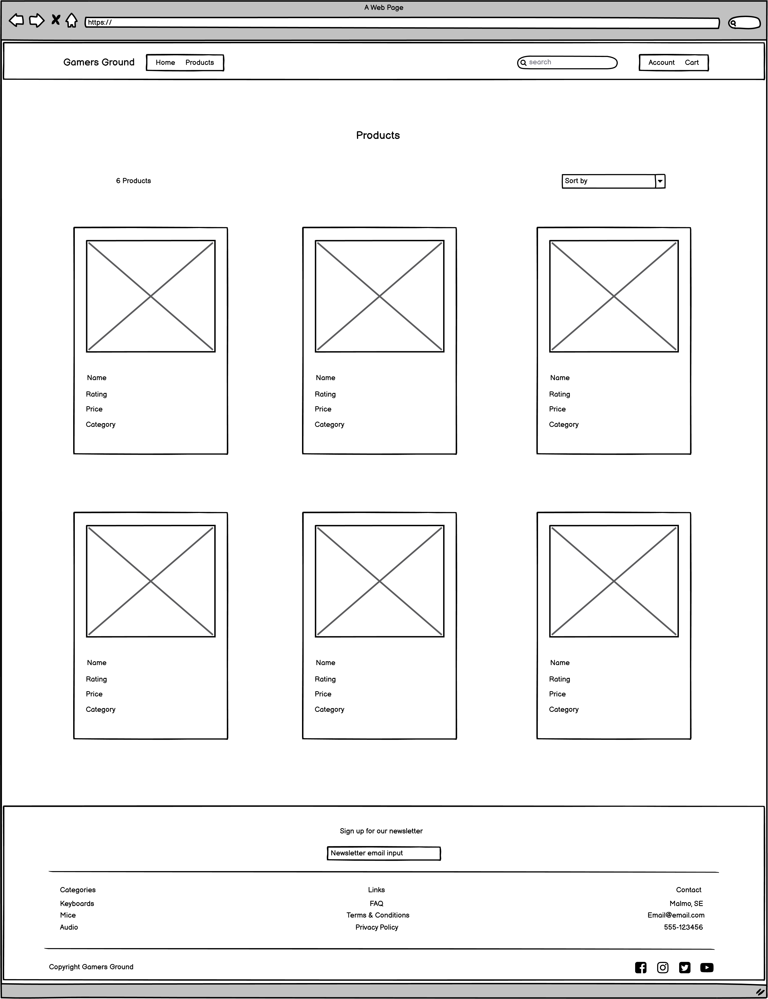

# Gamers Ground

Gamers Ground is a B2C e-commerce website for people interested in pc gaming. If you're a hardcore gamer that needs the best gear on the market, we got you covered! Looking for a more affordable option? We have what you need! We will continue to add new products as our stock will grow, so check in regularly to find your favourite gear.

*This project is a fictional e-commerce store that does not generate any revenue or take real orders. To place a mock order, please use the following card number: 4242 4242 4242 4242, with any expiration date in the future. To learn more about how to test the payment system, please visit [Stripe](https://stripe.com/docs/testing)*

[Find the live website here!](https://gamers-ground.herokuapp.com/)

# Table of Contents

# User Experience (UX)

The five planes of UX Design was implemented during the planning stage of the project. A summary of each stage is presented below.

## Strategy

### Target audience:

- Younger men and women interested in tech

- People with an interest in pc:s and gaming

- Friends and family looking for gifts to purchase

### User goals:

- Be able to browse through products in an intuitive and easy way

- Find valuable and understandable info about products

- Add multiple products to cart so I can buy more than one product at a time

- Purchase a product with minimal friction and receive confirmation

- Become a member and save my information for future purchases

- See previous orders as a member

- Leave ratings / reviews on products I have purchased

- View other customers ratings / reviews to help make an informed decision on purchasing a product

### Site admin goals:

- Have an easily manageable and trustworthy site

- Be able to add, edit and delete products from the stock

- Be able to edit / delete objectionable reviews left by site users

- If a user breaks site policy and behaves in an ill-mannered way, be able to remove their account

- Have an emailing list set up to promote my site with news and sales etc.

### User Stories

The user stories were implemented in an agile approach when creating the application, developed in order of importance. They were broken up into the following Epics to help with project management.

- #### EPIC: User Authentication / Accounts

  - As a Site User I can register an account so that I can sign in / out when revisiting the site.

  - As a Signed In User I can view and update my information so that I can make sure the correct info is stored on me.

  - As a Signed In User I can delete my account so that no information is stored on me.

  - As a Signed In User I can view previous order information so that I can see the details and make sure the orders are correct.

  - As a Signed In User I can save my info or have my information prefilled at checkout if it's already saved so that my saved info is used, and I don't have to fill it out.

  - As a Signed In User I can reset my password using my email so that I can gain access to my account if I forget my password.

- #### EPIC: User Site Navigation

  - As a Site User I can easily find and view products available so that I can browse products I may want to buy.

  - As a Site User I can click a product and view all info so that I can learn more about the product and see if I want to purchase it.

  - As a Site User I can search for products using keywords so that I can find a specific product I have in mind.

  - As a Site User I can add a filter to the products so that I can find specific products I am looking for.

  - As a Site User I can sort products by name, price, category etc. so that I can find certain / similar products easier.

  - As a Site User I can click on the cart so that I can view the products I have saved for purchase and my total cost.

  - As a Site User I can read other users reviews on products so that I can gain understanding of a products customer satisfaction.

- #### EPIC: User Site Interaction

  - As a Site User I can add products to a cart so that I can save it and purchase more than one product at a time.

  - As a Site User I can see the number of items OR the total cost by the cart icon in the upper right corner when editing my cart so that I know how many items I have added / how much my total is.

  - As a Site User I can edit my saved items on the cart page so that I can change my cart content as I wish.

  - As a Site User I can delete saved items on the cart page so that I can change my cart content as I wish.

  - As a Site User I can expect confirmation on my interactions with the site so that my actions get confirmed.

  - As a Site User I can rate / review products I have purchased so that I can share my product experience with other customers.

  - As a site user I can delete my own review so that I can decide which of my own content is visible, and I can write a new review if I wish.

- #### EPIC: User Checkout

  - As a Site User I can checkout and pay for the products in my cart so that I can buy and receive my newly purchased products.

  - As a Site User I can view details of my order on the checkout page so that I can make sure everything is correct before placing my order.

  - As a Site User I can have my order confirmed after a purchase so that I can be certain my payment was processed successfully.

- #### EPIC: Site Admin

  - As a Site admin I can add products to the site so that I can control the selection of products being sold.

  - As a Site admin I can ** edit products on the site** so that I can make sure the products being sold are correctly represented.

  - As a Site admin I can delete products on the site so that I can control the selection of products being sold.

  - As a Site Admin I can manage reviews posted by customers so that I can make sure no objectionable content is present.

## Scope

The scope of the project was determined by prioritizing to get a Minimum Viable Product deployed, and if time permits, add on additional features. A basic MoSCoW method was implemented on user stories where each user story received a label defining it as either 'Must Have', 'Should Have' or 'Could Have'. They were broken up into epics to gain better project overview and help plan the development process. Both tasks and acceptance criteria were given to each user story to assure that the intended feature was implemented correctly. For further details of tasks and acceptance criteria, and a list of all user stories, see this projects [GitHub Issues Tab](https://github.com/LucasBehrendt/gamers-ground/issues) In general, the higher priority user stories were implemented earlier.

### Core features

-	An inviting landing page that incentivizes the user to explore the site further

-	Products listings where users can search, filter and sort products in a relevant way

-	Products are visually inviting and professionally presented

-	Cart functionality to save multiple items for purchasing before proceeding to checkout

-	Checkout system that gives users a professional and trustworthy feel with confirmation email sent after a placed order

-	Authentication system for site users, where they can save their info and view previous orders

-	User feedback on all interactions with the site, such as adding to cart, signing up, updating cart etc

-	Site admin have full CRUD functionality over products and can control the selection of products entirely (Through site UI)

-	Ratings / review system for customers who wants to give feedback on purchased products

-	Site admin have full CRUD functionality over written reviews and can remove objectionable ones (Through Django Admin panel)

## Structure

The website is structured with simplicity and accessibility in mind, where both shoppers and site admins can intuitively navigate the site. Consistency in structure and layout is evident, to allow site users to gain a recognizable feel of the Gamers Ground brand. Combined with predictable behaviour and layout through all site pages, navigation through the site is a pleasing and positive experience.

### Business Model

The business model is centered around Business-to-Consumer (B2C), where emphasis has been put on provoking a positive response and an easy to use e-commerce platform. Where business customers usually do a lot of research and require large amounts of information about products, often the opposite is true for consumers. The shopping experience is often impulsive and emotionally driven, and a purchase should be as easy and frictionless as possible. To achieve this, a number of interaction designs were kept in mind when structuring the site. The flow of information is kept at a pleasing level to prevent cognitive overload with users. The review system uses a user-friendly star rating system to incentivize users to leave reviews on products. The checkout and payment process have been implemented with minimal friction in mind, and short clicking distances coupled with intuitive navigation are key in creating a frictionless and pleasing shopping experience. The site is fully resposive so users can choose to do their shopping from a device of their own choosing.

### Information Architecture

To facilitate an intuitive and easily navigated site, Information Architecture was considered when structuring the pages throughout the website. Features that help users understand where they are, and where certain information can be found were implemented. Examples of these features include user-friendly urls, that show both the category and the product name when viewing a specific product, a breadcrumb navigation on product list and detail pages for ease of access to other related products, and clear confirmations on all user interactions.

To help facilitate a logical flow of the application during the development process, a simple flowchart / site map was created using [LucidChart](https://www.lucidchart.com/pages/).

Flowchart / Site Map

## Skeleton

The structure and layout defined above was expressed with the help of wireframes in the planning process. These mock-ups are intended to show the overall layout of all pages within the website. While the wireframes are similar to the finished project, some changes were made during development to better suit content, information architecture, and overall structure.

The authentications system / templates with sign in, sign out, registration, email verification etc. was provided by Allauth. The templates used have only been slightly styled to fit the rest of the site, and therefore no wireframes were made of those pages.

### Wireframes

[Balsamiq](https://balsamiq.com/) was utilized when creating the wireframes below.

Desktop wireframes

Home Page 

Products Page 

Product Detail Page 

Cart Page 

Checkout Page 

Checkout Success Page 

Profile Page 

Add Product Page (site admins) 

Mobile wireframes

Home Page 

Products Page 

Product Detail Page 

Cart Page 

Checkout Page 

Checkout Success Page 

Profile Page 

Add Product Page (site admins) 

## Surface

The websites surface is designed to be inviting and polished so as to invoke a positive response from users when they land on the home page. Several call to action buttons help incentivize the user to explore the site further. A balanced feel of simplicity and gaming themed design was prioritized, and low friction was always kept in mind during the designing phase.

### Design
- #### Colours

  The colours used on the site are meant to convey a theme of pc gaming with dark / mid grey, complemented with a popping lime / neon green colour for buttons and links. The main background colour is a mid grey colour (#33363f) that goes nicely with the theme and the palette chosen. Sections, cards and header / footer breaks off the background with a darker grey (#212228) that complements each other nicely. The green colour chosen for the buttons and links (#35C71E) help make the website feel more vibrant and catches the users attention straight upon landing on the home page. It also goes very nicely with the grey colours and give good contrast to text / elements. To help product cards and other module sized content stand out and feel more inviting, a solid black (#000) border was added in the later stages of development.

  Where necessary, a red 'danger' colour was implemented to alert users of an action where they would delete data, like a review or their account. The same goes for the site admin links / buttons where appropriate.

  

  
Colour Palette

  

  

- #### Imagery

  The images are an important part of mainly the landing page, where large gripping images are meant to convey a sense of gaming enthusiasm and excitement for shoppers. A bootstrap carousel at the very top of the home page shows three eye-catching images of gaming peripherals, and content hinting with a gaming desktop lies just underneath. A nicely laid out grid of categories with accompaning images is found further down, where users easily can find a quick route to their favourite category. Across the other pages, the product images are the main focus, to help keep a clean and minimalistic design. 

- #### Typography

  The font chosen for the site is Rubik, a nicely edgy and well fitting font for gaming and tech content. Both different font sizes and weights have been user throughout the site, and consistency was always kept in mind. If the font isn't imported correctly, Sans-serif will serve as fallback.

# Data Model

# Search Engine Optimization

# Marketing

# Agile Methodology (?)

# Features
## Features Left to Implement

# Testing
## Validator Testing
## Responsive Testing
## Lighthouse Testing
## Links and Form Testing
## Fixed Bugs
## Known/Unfixed Bugs

# Technologies Used
## Languages
## Programs & Libraries

# Deployment

# Credits
## Code
## Content
## Media
## Acknowledgements

